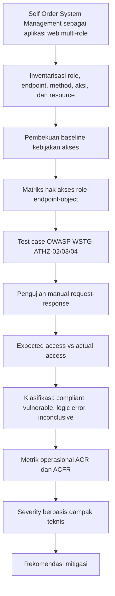

# PROPOSAL METODOLOGI PENELITIAN

# EVALUASI KONTROL OTORISASI PADA TINGKAT FUNGSI DAN OBJEK PADA APLIKASI WEB MULTI-ROLE MENGGUNAKAN OWASP WEB SECURITY TESTING GUIDE: STUDI KASUS SELF ORDER SYSTEM MANAGEMENT

Disusun untuk Memenuhi Tugas Mata Kuliah Metodologi Penelitian

**oleh:**  
**DONI SIMAMORA**  
**241401037**

PROGRAM STUDI ILMU KOMPUTER  
FAKULTAS ILMU KOMPUTER DAN TEKNOLOGI INFORMASI  
UNIVERSITAS SUMATERA UTARA  
MEDAN  
2026

\newpage

# KATA PENGANTAR

Puji syukur penulis panjatkan ke hadirat Tuhan Yang Maha Esa karena atas rahmat dan karunia-Nya, proposal Metodologi Penelitian yang berjudul **"Evaluasi Kontrol Otorisasi pada Tingkat Fungsi dan Objek pada Aplikasi Web Multi-Role Menggunakan OWASP Web Security Testing Guide: Studi Kasus Self Order System Management"** dapat disusun sebagai rancangan awal penelitian di bidang keamanan aplikasi web.

Proposal ini disusun untuk merumuskan permasalahan penelitian, dasar teori, metode penelitian, instrumen, serta rencana pengujian yang akan digunakan dalam mengevaluasi kontrol otorisasi pada aplikasi **Self Order System Management**. Fokus penelitian dibatasi pada pengujian otorisasi tingkat fungsi dan objek agar penelitian tetap terarah, etis, terukur, dan dapat dipertanggungjawabkan secara akademik.

Penulis menyadari bahwa proposal ini masih dapat disempurnakan sesuai arahan dosen pengampu atau pembimbing. Oleh karena itu, kritik dan saran yang membangun sangat diharapkan agar rancangan penelitian ini dapat menjadi lebih baik.

Medan, Juni 2026

Penulis

\newpage

# DAFTAR ISI

HALAMAN JUDUL  
KATA PENGANTAR  
DAFTAR ISI  
DAFTAR TABEL  
DAFTAR GAMBAR  
BAB I PENDAHULUAN  
1.1 Latar Belakang  
1.2 Identifikasi Masalah  
1.3 Rumusan Masalah  
1.4 Batasan Masalah  
1.5 Tujuan Penelitian  
1.6 Manfaat Penelitian  
1.7 Hipotesis Kerja Non-Statistik  
BAB II TINJAUAN PUSTAKA  
2.1 Aplikasi Web  
2.2 Authentication dan Authorization  
2.3 Access Control  
2.4 Role-Based Access Control  
2.5 Function-Level Authorization  
2.6 Object-Level Authorization  
2.7 Broken Access Control  
2.8 OWASP Web Security Testing Guide  
2.9 Penelitian Terdahulu  
2.10 Kerangka Berpikir  
BAB III METODE PENELITIAN  
3.1 Jenis dan Desain Penelitian  
3.2 Objek Penelitian  
3.3 Pembekuan Objek dan Baseline Kebijakan Akses  
3.4 Unit Analisis  
3.5 Definisi Operasional Komponen Evaluasi  
3.6 Populasi, Ruang Lingkup Teknis, dan Teknik Pengambilan Sampel  
3.7 Alat dan Bahan  
3.8 Instrumen Penelitian  
3.9 Teknik Pengumpulan Data  
3.10 Prosedur Penelitian  
3.11 Teknik Analisis Data  
3.12 Etika Penelitian  
3.13 Jadwal Penelitian  
3.14 Keterbatasan Penelitian  
DAFTAR PUSTAKA  
LAMPIRAN

\newpage

# DAFTAR TABEL

Tabel 2.1 Penelitian Terdahulu  
Tabel 3.1 Definisi Operasional Komponen Evaluasi  
Tabel 3.2 Kriteria Pemilihan Sampel Teknis  
Tabel 3.3 Alat dan Bahan Penelitian  
Tabel 3.4 Instrumen Penelitian  
Tabel 3.5 Aturan Analisis Actual Access  
Tabel 3.6 Klasifikasi Expected Access, Actual Access, dan Inconclusive  
Tabel 3.7 Kriteria Severity Kualitatif  
Tabel 3.8 Jadwal Penelitian  
Tabel L.1 Matriks Hak Akses Awal  
Tabel L.2 Rancangan Test Case Awal

# DAFTAR GAMBAR

Gambar 2.1 Kerangka Berpikir Penelitian

\newpage

# BAB I PENDAHULUAN

## 1.1 Latar Belakang

Aplikasi web modern umumnya digunakan oleh beberapa jenis pengguna dengan hak akses yang berbeda. Dalam aplikasi multi-role, pengguna dapat memiliki peran seperti pemilik sistem, kasir, pelanggan, operator, atau pengguna publik. Setiap peran seharusnya hanya dapat mengakses fungsi dan data sesuai izin yang telah ditetapkan. Namun, keberadaan login dan pembagian *role* belum tentu menjamin bahwa kontrol otorisasi telah diterapkan secara konsisten pada sisi server.

Dalam keamanan aplikasi, *authentication* dan *authorization* merupakan dua konsep yang berbeda. *Authentication* berfungsi untuk memverifikasi identitas pengguna, sedangkan *authorization* berfungsi untuk memverifikasi apakah tindakan atau layanan yang diminta memang diizinkan untuk identitas tersebut (OWASP Foundation, n.d.-a). Perbedaan ini penting karena aplikasi yang berhasil melakukan login belum tentu mampu mencegah pengguna mengakses fungsi atau *resource* di luar haknya.

OWASP menempatkan *Broken Access Control* sebagai A01 pada OWASP Top 10:2025. Kategori ini mencakup kegagalan pembatasan akses yang dapat menyebabkan pengguna melihat, mengubah, atau menghapus data tanpa izin, serta menjalankan fungsi bisnis di luar batas kewenangannya (OWASP Foundation, 2025). Contoh kegagalan yang relevan meliputi *force browsing*, manipulasi URL atau parameter, *privilege escalation*, *insecure direct object references* (IDOR), serta kontrol akses yang hanya diterapkan pada antarmuka pengguna.

Masalah tersebut semakin relevan pada aplikasi yang memiliki *endpoint* publik dan internal. Pembatasan menu pada *frontend* tidak cukup untuk menjamin keamanan apabila *endpoint backend* tetap dapat dipanggil secara langsung. OWASP menekankan bahwa kontrol akses harus ditegakkan pada kode tepercaya di sisi server dan harus divalidasi pada setiap *request*, bukan hanya disembunyikan melalui elemen antarmuka (OWASP Foundation, n.d.-a; OWASP Foundation, 2025).

Objek penelitian ini adalah **Self Order System Management**, yaitu aplikasi web untuk pemesanan mandiri berbasis QR Code dan manajemen transaksi kasir pada usaha kuliner. Self Order System Management merupakan aplikasi yang dibangun sendiri oleh penulis sebagai proyek pribadi atau tugas perkuliahan sebelumnya, kemudian dijalankan pada lingkungan lokal/laboratorium yang berada dalam kendali peneliti. Dengan demikian, pengujian dilakukan pada objek yang dapat dikontrol versi kode, konfigurasi, dan data ujinya, serta tidak melibatkan sistem publik, sistem produksi, atau data pengguna nyata.

Berdasarkan dokumentasi proyek, sistem ini memiliki *role* PUBLIC, CASHIER, dan OWNER, serta memisahkan *endpoint* publik, *endpoint* operasional internal, dan *endpoint* khusus OWNER. Struktur tersebut membuat Self Order System Management relevan digunakan sebagai objek evaluasi kontrol otorisasi pada tingkat fungsi dan objek.

Evaluasi kontrol otorisasi dalam penelitian ini tidak diarahkan untuk melakukan *penetration testing* secara luas. Penelitian ini hanya memeriksa apakah hak akses yang seharusnya berlaku telah sesuai dengan akses aktual yang diberikan oleh sistem. Fokus penelitian dibatasi pada *function-level authorization*, yaitu pengendalian akses terhadap fungsi atau *endpoint* tertentu, serta *object-level authorization*, yaitu pengendalian akses terhadap *resource* tertentu berdasarkan kepemilikan atau konteks sesi.

OWASP Web Security Testing Guide (WSTG) v4.2 dipilih sebagai dasar metode pengujian karena memiliki bagian khusus *Authorization Testing*. Bagian tersebut mencakup pengujian *bypassing authorization schema*, *privilege escalation*, dan *insecure direct object references* (OWASP Foundation, 2020a; OWASP Foundation, 2020b; OWASP Foundation, 2020c). Dengan menggunakan WSTG, skenario pengujian dapat disusun secara sistematis dan dapat direplikasi.

Secara metodologis, masalah ilmiah dalam penelitian ini adalah belum diketahui tingkat kesesuaian antara kebijakan akses yang seharusnya berlaku dan implementasi otorisasi aktual pada *endpoint* dan *resource* yang diuji. Kesenjangan tersebut diposisikan sebagai kesenjangan implementasi dan evaluasi, bukan sebagai klaim penemuan model teoretis baru. Oleh karena itu, penelitian ini berupaya menerapkan kerangka WSTG pada studi kasus nyata melalui pembekuan *baseline* hak akses, penyusunan matriks, penyusunan *test case*, dan pembuktian empiris melalui perbandingan antara *expected access* dan *actual access*. Dengan demikian, penelitian ini bukan penelitian pembuatan aplikasi, melainkan penelitian evaluatif terhadap kontrol teknis keamanan aplikasi web.

## 1.2 Identifikasi Masalah

Berdasarkan latar belakang tersebut, masalah penelitian dapat diidentifikasi sebagai berikut.

1. Aplikasi web multi-role dapat memiliki login dan *role*, tetapi belum tentu menerapkan otorisasi yang konsisten pada setiap *endpoint* dan *resource*.
2. Pembatasan akses yang hanya diterapkan pada *frontend* berisiko tidak efektif apabila *endpoint backend* tetap dapat diakses secara langsung.
3. Self Order System Management memiliki *role* PUBLIC, CASHIER, dan OWNER sehingga membutuhkan verifikasi terhadap pemisahan hak akses fungsi publik, fungsi operasional kasir, dan fungsi khusus OWNER.
4. Fitur *public order* berbasis QR/*session token* memerlukan pengujian *object-level authorization* agar pengguna tidak dapat mengakses pesanan atau sesi yang bukan miliknya.
5. Belum terdapat evaluasi sistematis terhadap kesesuaian antara matriks hak akses yang seharusnya berlaku dan akses aktual yang diberikan oleh sistem.

## 1.3 Rumusan Masalah

Rumusan masalah dalam penelitian ini adalah sebagai berikut.

1. Bagaimana menyusun *baseline* kebijakan akses dan matriks hak akses pada Self Order System Management berdasarkan *role*, *endpoint*, *method*, dan konteks objek?
2. Bagaimana menyusun skenario *authorization testing* berdasarkan OWASP WSTG v4.2 pada tingkat fungsi dan objek?
3. Apakah implementasi aktual kontrol otorisasi pada Self Order System Management sudah sesuai dengan hak akses yang diharapkan?
4. Bagaimana hasil evaluasi tingkat kepatuhan otorisasi berdasarkan perbandingan *expected access* dan *actual access*, serta bagaimana hasil tersebut diklasifikasikan menjadi *compliant*, *vulnerable*, *logic error*, atau *inconclusive*?
5. Rekomendasi mitigasi apa yang dapat diberikan terhadap kelemahan kontrol otorisasi yang ditemukan?

## 1.4 Batasan Masalah

Agar penelitian tetap fokus, batasan masalah dalam penelitian ini adalah sebagai berikut.

1. Objek penelitian dibatasi pada aplikasi Self Order System Management yang dijalankan pada lingkungan lokal atau laboratorium.
2. *Role* yang diuji dibatasi pada PUBLIC, CASHIER, dan OWNER. Untuk pengujian *object-level*, identitas publik dapat dibedakan menjadi PUBLIC-A dan PUBLIC-B.
3. Pengujian hanya mencakup *function-level authorization* dan *object-level authorization*.
4. Skenario pengujian mengacu pada OWASP WSTG v4.2, khususnya WSTG-ATHZ-02, WSTG-ATHZ-03, dan WSTG-ATHZ-04.
5. Penelitian tidak membahas SQL Injection, Cross-Site Scripting, CSRF, *brute force*, *malware*, *social engineering*, *network exploitation*, atau *red teaming* secara umum.
6. Pengujian tidak dilakukan pada sistem publik atau sistem pihak ketiga tanpa izin.
7. Data yang digunakan dalam pengujian merupakan data dummy atau data uji yang aman digunakan di lingkungan lokal.

## 1.5 Tujuan Penelitian

Tujuan umum penelitian ini adalah mengevaluasi kontrol otorisasi pada tingkat fungsi dan objek pada aplikasi Self Order System Management menggunakan OWASP Web Security Testing Guide.

Tujuan khusus penelitian ini adalah sebagai berikut.

1. Menyusun *baseline* kebijakan akses dan matriks hak akses pada objek penelitian.
2. Menyusun *test case authorization testing* berdasarkan OWASP WSTG v4.2.
3. Mengevaluasi tingkat kesesuaian antara implementasi aktual kontrol otorisasi pada Self Order System Management dan hak akses yang diharapkan pada dokumen *baseline*.
4. Menganalisis hasil evaluasi menggunakan metrik operasional *Authorization Compliance Rate* (ACR) dan *Access Control Failure Rate* (ACFR), serta mengklasifikasikan hasil pengujian berdasarkan perbandingan *expected access* dan *actual access*.
5. Menyusun rekomendasi mitigasi terhadap kelemahan kontrol otorisasi yang ditemukan.

## 1.6 Manfaat Penelitian

### 1.6.1 Manfaat Teoretis

Penelitian ini diharapkan memberikan contoh penerapan OWASP WSTG v4.2 dalam evaluasi kontrol otorisasi pada aplikasi web multi-role. Penelitian ini juga memperjelas posisi RBAC sebagai *baseline role model* dan pentingnya konteks objek atau atribut dalam keputusan otorisasi modern (Sandhu et al., 1996; Hu et al., 2015; Jin et al., 2012).

### 1.6.2 Manfaat Praktis

Penelitian ini dapat membantu pengembang memahami bahwa kontrol otorisasi perlu ditegakkan pada sisi server dan divalidasi pada setiap *request*. Hasil penelitian dapat menjadi dasar perbaikan *endpoint*, *middleware*, *policy enforcement*, dan validasi kepemilikan objek.

### 1.6.3 Manfaat Akademis

Penelitian ini memberikan contoh penelitian Informatika yang tidak berfokus pada pembuatan aplikasi, melainkan pada evaluasi sistematis terhadap mekanisme keamanan aplikasi. Kontribusi penelitian berupa matriks hak akses, *test case*, bukti pengujian, metrik evaluasi, dan rekomendasi mitigasi.

## 1.7 Hipotesis Kerja Non-Statistik

Penelitian ini tidak menggunakan hipotesis statistik karena tidak bertujuan menguji hubungan antarvariabel pada populasi responden manusia. Penelitian ini menggunakan pendekatan evaluatif teknis dengan unit analisis berupa keputusan otorisasi pada kombinasi aktor, *endpoint*, *method*, aksi, dan konteks objek.

Sebagai pengarah pengujian, penelitian ini menggunakan hipotesis kerja non-statistik bahwa masih terdapat kemungkinan ketidaksesuaian antara *baseline* kebijakan akses dan implementasi aktual kontrol otorisasi pada sebagian *endpoint* atau *resource* yang diuji. Hipotesis kerja ini akan dievaluasi melalui perbandingan *expected access* dan *actual access* pada setiap *test case*. Jika seluruh hasil pengujian sesuai dengan *baseline*, maka hipotesis kerja tersebut tidak terbukti pada versi objek yang diuji.

\newpage

# BAB II TINJAUAN PUSTAKA

## 2.1 Aplikasi Web

Aplikasi web adalah perangkat lunak yang berjalan melalui protokol web dan dapat diakses melalui browser atau antarmuka API. Dalam arsitektur modern, aplikasi web sering memisahkan *frontend* dan *backend*, sehingga fungsi utama sistem diekspos melalui *endpoint* API. Kondisi ini membuat mekanisme autentikasi dan otorisasi pada *backend* menjadi penting karena *endpoint* dapat dipanggil secara langsung tanpa melalui antarmuka pengguna.

Pada konteks penelitian ini, aplikasi web yang dikaji adalah Self Order System Management. Sistem ini menggunakan *frontend* berbasis React dan *backend* REST API. *Endpoint* yang tersedia mencakup *endpoint* publik untuk *customer order*, *endpoint* internal untuk CASHIER, dan *endpoint* khusus OWNER untuk manajemen sistem. Pembagian tersebut membentuk konteks multi-role yang perlu diuji secara sistematis.

## 2.2 Authentication dan Authorization

*Authentication* adalah proses untuk memastikan identitas pengguna, sedangkan *authorization* adalah proses untuk menentukan apakah pengguna atau entitas tersebut diizinkan melakukan aksi tertentu. OWASP Authorization Cheat Sheet menekankan bahwa *authorization* harus dipisahkan dari *authentication* karena login yang berhasil tidak otomatis berarti seluruh akses pengguna sudah sah (OWASP Foundation, n.d.-a).

Dalam aplikasi web multi-role, *authentication* biasanya diwujudkan melalui login, sesi, token, atau kredensial. *Authorization* diwujudkan melalui pemeriksaan *role*, *permission*, kebijakan, atau kepemilikan objek sebelum sistem menjalankan fungsi tertentu. Penelitian ini berfokus pada *authorization*, bukan pada mekanisme login atau kekuatan kata sandi.

## 2.3 Access Control

*Access control* adalah mekanisme untuk menegakkan kebijakan akses agar pengguna tidak bertindak di luar izin yang dimilikinya. OWASP menjelaskan bahwa kegagalan *access control* dapat menyebabkan paparan data, perubahan data tanpa izin, penghapusan data, atau pelaksanaan fungsi bisnis oleh pihak yang tidak berwenang (OWASP Foundation, 2025).

Prinsip penting dalam *access control* adalah *deny by default*, validasi izin pada setiap *request*, dan *enforcement* pada kode tepercaya di sisi server. OWASP Authorization Cheat Sheet juga menekankan bahwa kontrol akses harus dirancang sebagai mekanisme yang eksplisit dan konsisten, bukan hanya berdasarkan penyembunyian menu di *frontend* (OWASP Foundation, n.d.-a).

## 2.4 Role-Based Access Control

*Role-Based Access Control* (RBAC) adalah model kontrol akses yang menghubungkan *permission* dengan *role*. Dalam model ini, pengguna memperoleh izin berdasarkan *role* yang melekat pada dirinya. Sandhu et al. (1996) menjelaskan RBAC sebagai model yang menyederhanakan administrasi izin melalui hubungan *user-role*, *role-permission*, dan *role hierarchy*.

RBAC relevan untuk Self Order System Management karena sistem memiliki *role* PUBLIC, CASHIER, dan OWNER. Akan tetapi, RBAC tidak selalu cukup untuk memodelkan keputusan akses yang bergantung pada objek tertentu. Misalnya, pengguna publik dapat memiliki akses ke *endpoint tracking order* hanya jika token atau sesi yang digunakan memang terkait dengan pesanan tersebut. Oleh karena itu, penelitian ini tidak hanya menggunakan konsep RBAC, tetapi juga memperhatikan konteks atribut dan kepemilikan objek.

Dalam penelitian ini, ABAC tidak digunakan sebagai model formal yang diuji secara penuh. ABAC diposisikan sebagai landasan konseptual untuk menjelaskan bahwa keputusan otorisasi modern tidak hanya bergantung pada *role*, tetapi juga dapat dipengaruhi oleh atribut atau konteks objek seperti token, sesi, dan kepemilikan *resource*. Dengan demikian, fokus implementatif penelitian tetap berada pada kombinasi RBAC, *function-level authorization*, dan pemeriksaan kepemilikan objek secara kontekstual.

## 2.5 Function-Level Authorization

*Function-level authorization* adalah kontrol akses terhadap fungsi, halaman, atau *endpoint* berdasarkan *role* atau tingkat hak pengguna. OWASP WSTG-ATHZ-02 menjelaskan bahwa pengujian *authorization schema* perlu memeriksa apakah pengguna dapat mengakses *resource* secara horizontal atau vertikal di luar izin yang seharusnya (OWASP Foundation, 2020a).

Dalam penelitian ini, *function-level authorization* diuji pada *endpoint* seperti `/api/internal/users`, `/api/internal/reports`, `/api/internal/orders`, dan *endpoint* operasional lain. Contoh skenario adalah CASHIER mencoba mengakses *endpoint* manajemen pengguna yang seharusnya hanya diizinkan untuk OWNER.

## 2.6 Object-Level Authorization

*Object-level authorization* adalah kontrol akses terhadap objek atau *resource* tertentu berdasarkan kepemilikan, relasi, token, atau konteks akses. Model ini diperlukan karena dua pengguna dengan *role* yang sama belum tentu boleh mengakses objek yang sama. Hu et al. (2015) dan Jin et al. (2012) menunjukkan bahwa *access control* berbasis atribut dapat menangani keputusan akses yang lebih kontekstual dibandingkan RBAC murni.

OWASP WSTG-ATHZ-04 menjelaskan pengujian IDOR dengan memetakan parameter yang mereferensikan objek secara langsung, lalu memodifikasi nilai tersebut untuk melihat apakah objek milik pengguna lain dapat diakses (OWASP Foundation, 2020c). Dalam penelitian ini, skenario *object-level authorization* relevan pada *public order tracking* berbasis QR atau *session token*.

Dalam konteks REST API, fokus ini juga selaras dengan OWASP API Security Top 10:2023 kategori API1:2023 *Broken Object Level Authorization* (BOLA). OWASP menjelaskan bahwa BOLA terjadi ketika API menerima ID objek dari klien, tetapi gagal memastikan bahwa pengguna yang sedang masuk memang memiliki izin terhadap objek tersebut (OWASP Foundation, 2023a). Oleh karena itu, pengujian *object-level authorization* dalam penelitian ini diarahkan pada skenario manipulasi ID, token, atau konteks sesi yang berkaitan dengan pesanan publik.

## 2.7 Broken Access Control

*Broken Access Control* adalah kondisi ketika sistem gagal membatasi akses pengguna sesuai izin yang seharusnya. OWASP Top 10:2025 menempatkan *Broken Access Control* sebagai A01 dan menyebutkan contoh seperti *force browsing*, *parameter tampering*, IDOR, *missing access control* pada *HTTP method* sensitif, dan *privilege escalation* (OWASP Foundation, 2025).

Dalam penelitian ini, suatu *test case* dikategorikan sebagai *vulnerable* apabila *expected access* adalah *deny* tetapi *actual access* menunjukkan *allow*. Kriteria tersebut membuat penilaian dilakukan secara terukur melalui perbandingan antara *baseline* kebijakan akses dan respons aktual sistem.

Untuk aplikasi berbasis REST API, *function-level authorization* juga berkaitan dengan OWASP API Security Top 10:2023 kategori API5:2023 *Broken Function Level Authorization* (BFLA). OWASP menjelaskan bahwa BFLA muncul ketika pengguna anonim atau pengguna dengan hak rendah dapat mengakses fungsi atau endpoint yang seharusnya tidak boleh diakses, termasuk fungsi administratif atau fungsi sensitif lainnya (OWASP Foundation, 2023b).

## 2.8 OWASP Web Security Testing Guide

OWASP Web Security Testing Guide (WSTG) merupakan panduan pengujian keamanan aplikasi web. Penelitian ini menggunakan WSTG v4.2 karena versi tersebut stabil dan memiliki bagian *Authorization Testing* yang relevan untuk ruang lingkup penelitian (OWASP Foundation, 2020a; OWASP Foundation, 2020b; OWASP Foundation, 2020c).

Tiga bagian WSTG yang digunakan adalah WSTG-ATHZ-02 untuk *bypassing authorization schema*, WSTG-ATHZ-03 untuk *privilege escalation*, dan WSTG-ATHZ-04 untuk *insecure direct object references*. Ketiganya dipilih karena sesuai dengan fokus penelitian pada otorisasi tingkat fungsi dan objek.

Selain WSTG, OWASP API Security Top 10:2023 digunakan sebagai rujukan pendukung untuk memperjelas terminologi pada konteks API. API1:2023 BOLA digunakan untuk memperkuat pembahasan *object-level authorization*, sedangkan API5:2023 BFLA digunakan untuk memperkuat pembahasan *function-level authorization*. Rujukan API Security Top 10 tidak digunakan sebagai metode pengujian utama, melainkan sebagai kerangka klasifikasi konseptual karena objek penelitian menggunakan REST API sebagai antarmuka utama antara *frontend* dan *backend*. Metode pengujian utama tetap mengacu pada OWASP WSTG v4.2.

## 2.9 Penelitian Terdahulu

Penelitian terdahulu yang digunakan dipilih dari jurnal atau prosiding internasional bereputasi seperti IEEE, ACM, Springer, Elsevier, dan *Computers & Security*. Sumber resmi seperti OWASP dan NIST diposisikan sebagai standar atau panduan teknis, sedangkan artikel ilmiah diposisikan sebagai literatur konseptual dan empiris pendukung. Sebelum naskah final dicetak, verifikasi akhir terhadap status indeks Scopus tetap perlu dilakukan melalui Scopus Preview, akses perpustakaan kampus, atau bantuan pustakawan.

**Tabel 2.1 Penelitian Terdahulu**

| No. | Penulis | Fokus | Relevansi dengan Penelitian |
|---:|---|---|---|
| 1 | Sandhu et al. (1996) | Model RBAC | Menjadi dasar konseptual pembagian *role* dan *permission* pada aplikasi multi-role. |
| 2 | Hu et al. (2015) | ABAC | Menjelaskan penggunaan atribut subjek, objek, aksi, dan lingkungan untuk keputusan akses. |
| 3 | Jin et al. (2012) | Unified ABAC | Menunjukkan bahwa ABAC dapat mencakup DAC, MAC, dan RBAC sehingga cocok untuk keputusan akses yang lebih kontekstual. |
| 4 | Park dan Sandhu (2004) | Usage Control | Memperluas *access control* klasik dengan konsep kontinuitas keputusan dan atribut yang berubah. |
| 5 | Fuchs et al. (2011) | Role dalam keamanan informasi | Memberi peta penelitian tentang *role* dalam keamanan informasi dan keterbatasan *role* pada sistem besar. |
| 6 | Bonatti dan Samarati (2002) | Web service access control | Relevan untuk kebijakan akses dan pelepasan informasi pada layanan web. |
| 7 | Silva et al. (2018) | Distributed ABAC | Mendukung argumentasi bahwa ABAC berguna untuk kebijakan akses yang kompleks dan terdistribusi. |
| 8 | Bau et al. (2010) | Evaluasi otomatisasi pengujian kerentanan web | Mendukung alasan bahwa pengujian keamanan aplikasi tidak cukup hanya mengandalkan pemindaian otomatis. |
| 9 | Doupé et al. (2010) | Analisis keterbatasan *black-box web scanner* | Menguatkan pemilihan *manual security testing* berbasis skenario terkontrol. |

Berdasarkan Tabel 2.1, sebagian literatur berfokus pada pengembangan model konseptual *access control*, seperti RBAC, ABAC, dan *usage control*. Literatur tersebut penting sebagai dasar untuk memahami bagaimana hak akses dapat dimodelkan melalui *role*, atribut, aksi, objek, dan konteks tertentu. Literatur lain membahas keterbatasan pemindaian otomatis dalam pengujian keamanan aplikasi web, sehingga mendukung penggunaan pengujian manual berbasis skenario.

Walaupun demikian, penelitian terdahulu yang dirangkum belum secara spesifik membahas penerapan evaluasi otorisasi berbasis *baseline* kebijakan akses, matriks hak akses, *test case* OWASP WSTG, bukti *request-response*, dan metrik operasional pada satu aplikasi web multi-role yang dikendalikan peneliti. Dengan demikian, posisi penelitian ini adalah penelitian evaluatif terapan. Kontribusinya bukan menciptakan model *access control* baru, melainkan menyusun dan menerapkan prosedur evaluatif yang sistematis, terukur, dan dapat direplikasi pada studi kasus Self Order System Management.

Kesenjangan penelitian yang digunakan dalam proposal ini bersifat implementatif-evaluatif. Artinya, penelitian tidak mengklaim kekosongan teori umum tentang *access control*, tetapi menyoroti belum adanya evaluasi terstruktur pada objek penelitian yang menghubungkan kebijakan akses, implementasi aktual, bukti teknis, klasifikasi hasil, dan metrik evaluasi dalam satu alur penelitian yang eksplisit.

## 2.10 Kerangka Berpikir

Kerangka berpikir penelitian ini dimulai dari keberadaan Self Order System Management sebagai aplikasi web multi-role yang memiliki beberapa jenis pengguna, yaitu PUBLIC, CASHIER, dan OWNER. Setiap *role* memiliki batasan hak akses yang berbeda terhadap *endpoint*, fungsi, dan *resource* tertentu. Kondisi tersebut menuntut adanya pemetaan sistematis terhadap *role*, *endpoint*, *method*, aksi, dan konteks objek yang menjadi dasar keputusan otorisasi.

Langkah berikutnya adalah membekukan *baseline* kebijakan akses. *Baseline* ini menjadi titik acuan untuk menentukan apakah suatu aktor seharusnya diberi akses atau ditolak. Tanpa *baseline*, hasil pengujian akan sulit dinilai karena peneliti tidak memiliki standar pembanding yang eksplisit. Oleh sebab itu, *baseline* disusun terlebih dahulu dari dokumentasi sistem, definisi *route* dan *middleware backend*, serta kebutuhan fungsi aplikasi.

Setelah *baseline* ditetapkan, hak akses diterjemahkan ke dalam matriks yang menghubungkan aktor, *endpoint*, *method*, aksi, dan konteks objek. Matriks ini kemudian digunakan untuk menyusun *test case* berdasarkan OWASP WSTG v4.2, terutama WSTG-ATHZ-02, WSTG-ATHZ-03, dan WSTG-ATHZ-04. Pada konteks REST API, istilah BFLA dan BOLA dari OWASP API Security Top 10:2023 digunakan sebagai klasifikasi konseptual untuk membedakan pengujian fungsi dan pengujian objek.

Setiap *test case* dijalankan secara manual melalui *request-response* yang terdokumentasi. Hasil pengujian kemudian dianalisis dengan membandingkan *expected access* dan *actual access*. Jika hasil aktual sesuai dengan *baseline*, hasil diklasifikasikan sebagai *compliant*. Jika akses yang seharusnya ditolak ternyata diizinkan, hasil diklasifikasikan sebagai *vulnerable*. Jika akses yang seharusnya diizinkan justru ditolak, hasil diklasifikasikan sebagai *logic error*. Jika hasil tidak dapat disimpulkan karena kesalahan teknis atau hasil *re-test* tidak konsisten, hasil diberi status *inconclusive*.

Hasil klasifikasi tersebut digunakan untuk menghitung metrik operasional ACR dan ACFR, menilai tingkat *severity* berdasarkan dampak teknis di sisi server, dan menyusun rekomendasi mitigasi. Dengan demikian, kerangka berpikir penelitian ini tidak hanya menggambarkan urutan kerja, tetapi juga menunjukkan hubungan logis antara objek penelitian, *baseline*, instrumen, data, analisis, dan keluaran penelitian.

**Gambar 2.1 Kerangka Berpikir Penelitian**

\newpage

# BAB III METODE PENELITIAN

## 3.1 Jenis dan Desain Penelitian

Penelitian ini menggunakan jenis penelitian evaluatif dengan desain studi kasus. Penelitian evaluatif dipilih karena tujuan utama penelitian adalah menilai kesesuaian antara *baseline* kebijakan akses dan implementasi aktual kontrol otorisasi pada satu objek aplikasi web. Desain studi kasus digunakan karena penelitian difokuskan pada Self Order System Management sebagai objek yang dianalisis secara mendalam.

Penelitian ini bersifat kuantitatif-deskriptif dalam hal pengukuran ACR dan ACFR, dengan pendekatan studi kasus sebagai kerangka pemilihan dan kedalaman analisis objek. Tujuan penelitian bukan generalisasi statistik terhadap seluruh aplikasi web multi-role, melainkan evaluasi mendalam terhadap satu objek terkontrol berdasarkan *baseline*, matriks hak akses, *test case*, dan bukti *request-response*.

Pendekatan pengujian yang digunakan adalah *manual security testing* berbasis *test case*. Pengujian tidak dilakukan dengan *automated scanning* sebagai metode utama. Alat seperti Postman, `curl`, atau Burp Suite Community hanya digunakan untuk membantu mengirim, menangkap, dan memodifikasi *request* secara terkontrol sesuai *test case*.

## 3.2 Objek Penelitian

Objek penelitian ini adalah aplikasi Self Order System Management yang dibangun sendiri oleh penulis dan dijalankan pada lingkungan lokal atau laboratorium. Aplikasi ini dipilih karena memiliki *role* PUBLIC, CASHIER, dan OWNER; memiliki *endpoint* publik dan internal; serta memiliki *resource* yang bergantung pada konteks sesi atau token. Objek penelitian tidak diarahkan pada sistem produksi atau sistem pihak ketiga.

*Scope* objek dibatasi pada *endpoint* yang berkaitan dengan *authorization testing*, yaitu *endpoint public order*, *endpoint* operasional kasir, *endpoint* khusus OWNER, dan *endpoint* yang menggunakan *identifier* atau token untuk mengakses *resource* tertentu.

Lingkungan uji dirancang sebagai *testbed* lokal yang merepresentasikan arsitektur aplikasi sebenarnya. Aplikasi dapat dijalankan menggunakan konfigurasi *runtime* yang sesuai dengan proyek, misalnya Node.js/Express untuk *backend*, React untuk *frontend*, dan basis data lokal untuk menyimpan dataset dummy. Apabila proyek menggunakan Docker, konfigurasi *container* dan berkas konfigurasi terkait harus dicatat pada format pembekuan objek. Untuk memverifikasi modifikasi entitas pada sisi server, peneliti dapat menggunakan *database client* atau *log viewer* yang sesuai dengan basis data yang digunakan.

## 3.3 Pembekuan Objek dan Baseline Kebijakan Akses

Sebelum pengujian dilakukan, objek penelitian harus dibekukan pada satu versi kode tertentu. Pembekuan dilakukan dengan mencatat *branch*, *commit hash*, tanggal *freeze*, versi migrasi basis data, konfigurasi *runtime*, dan dataset dummy yang digunakan. Langkah ini penting agar hasil pengujian dapat direplikasi dan tidak berubah akibat modifikasi *endpoint* selama penelitian berlangsung.

*Baseline* kebijakan akses ditetapkan sebelum *test case* dijalankan. *Baseline* tersebut berisi daftar *role*, *endpoint*, *method*, aksi, *resource*, dan status *expected access*. Sumber penetapan *baseline* diurutkan dari dokumentasi kebutuhan atau spesifikasi sistem, definisi *route* dan *middleware backend*, dokumentasi proyek, serta validasi dengan pengembang atau pemilik sistem. Perilaku *frontend* hanya digunakan sebagai indikator pendukung, bukan sumber utama penetapan kebijakan akses.

Setelah *baseline* dibekukan, perubahan terhadap *baseline* tidak diperbolehkan selama pengujian utama berlangsung. Apabila terdapat perubahan yang tidak dapat dihindari, perubahan tersebut harus didokumentasikan sebagai versi *baseline* terpisah dan tidak dicampur dengan hasil pengujian dari versi sebelumnya. Aturan ini diterapkan untuk mengurangi bias karena peneliti memiliki kendali terhadap objek yang diuji.

## 3.4 Unit Analisis

Unit analisis dalam penelitian ini adalah satu keputusan otorisasi pada kombinasi tertentu antara aktor, *role*, *endpoint*, *HTTP method*, aksi, target objek, konteks token atau sesi, *expected access*, dan *actual access*. Format ini digunakan karena keputusan otorisasi tidak hanya dipengaruhi oleh *role*, tetapi juga oleh fungsi yang diakses dan objek yang menjadi target akses.

Contoh unit analisis adalah CASHIER yang mengakses *endpoint* `/api/internal/users` dengan *method* GET. Jika *baseline* menyatakan *endpoint* tersebut hanya boleh diakses OWNER, maka *expected access* untuk CASHIER adalah *deny*. Apabila *actual access* menunjukkan *allow*, maka *test case* tersebut diklasifikasikan sebagai *vulnerable* karena terjadi indikasi *Broken Function Level Authorization*.

## 3.5 Definisi Operasional Komponen Evaluasi

Penelitian ini tidak memosisikan komponen penelitian sebagai variabel bebas dan variabel terikat dalam arti eksperimen sosial atau statistik klasik. Karena penelitian ini merupakan studi evaluatif teknis, komponen yang didefinisikan secara operasional adalah unsur-unsur evaluasi yang digunakan untuk menilai keputusan otorisasi sistem.

**Tabel 3.1 Definisi Operasional Komponen Evaluasi**

| Komponen Evaluasi | Definisi Operasional | Indikator |
|---|---|---|
| Skenario uji | Kombinasi aktor, *role*, *endpoint*, *method*, aksi, dan konteks objek yang disimulasikan. | Aktor, *role*, *endpoint*, *method*, aksi, objek, token/sesi. |
| *Expected access* | Keputusan akses yang seharusnya terjadi berdasarkan *baseline* kebijakan akses. | *Allow*, *deny*, atau N/A. |
| *Actual access* | Keputusan akses aktual yang diberikan sistem saat *test case* dijalankan. | *Allow*, *deny*, atau *inconclusive*. |
| Klasifikasi hasil | Kategori hasil berdasarkan perbandingan *expected access* dan *actual access*. | *Compliant*, *vulnerable*, *logic error*, atau *inconclusive*. |
| Dampak server-side | Dampak teknis yang terjadi pada sisi server akibat *request* yang diuji. | Paparan data, akses fungsi internal, atau modifikasi entitas pada basis data. |
| *Evidence* | Bukti teknis yang mendukung hasil pengujian. | *Request*, *response*, status HTTP, potongan respons, dan catatan perubahan data. |

## 3.6 Populasi, Ruang Lingkup Teknis, dan Teknik Pengambilan Sampel

Dalam penelitian teknis ini, istilah populasi tidak merujuk pada responden manusia. Populasi teknis penelitian adalah seluruh *endpoint*, *role*, *method*, aksi, dan *resource* yang terdapat pada Self Order System Management. Dari populasi teknis tersebut, penelitian menetapkan ruang lingkup pengujian pada bagian sistem yang berkaitan dengan kontrol otorisasi, kemudian memilih sampel teknis berdasarkan kriteria risiko dan relevansi terhadap tujuan evaluasi.

Teknik pengambilan sampel yang digunakan adalah *purposive sampling*. Sampel dalam penelitian ini bukan responden manusia, melainkan *endpoint*, *role*, *method*, aksi, dan *resource* yang dipilih secara bertujuan berdasarkan kriteria tertentu yang relevan dengan pengujian otorisasi.

**Tabel 3.2 Kriteria Pemilihan Sampel Teknis**

| No. | Kriteria Sampel | Alasan Pemilihan |
|---:|---|---|
| 1 | *Endpoint* membedakan akses antar-*role*. | Mewakili *function-level authorization* dan BFLA. |
| 2 | *Endpoint* internal atau khusus OWNER. | Menguji kemungkinan *vertical privilege escalation*. |
| 3 | *Endpoint* menggunakan ID, token, atau konteks sesi. | Mewakili *object-level authorization*, BOLA, dan IDOR. |
| 4 | *Endpoint* dengan *method* POST, PATCH, atau DELETE. | Menguji fungsi yang dapat mengubah status atau entitas pada sisi server. |
| 5 | *Endpoint* yang mengakses data operasional atau fungsi sensitif. | Meningkatkan relevansi risiko pengujian. |

Berdasarkan kriteria tersebut, penelitian ini menentukan 20 skenario *test case* spesifik yang dicantumkan pada Lampiran C. Dua puluh *test case* tersebut dipilih karena telah mencakup seluruh *role* utama, yaitu PUBLIC, CASHIER, dan OWNER; mencakup skenario *allow* dan *deny*; mencakup *endpoint* publik dan internal; mencakup fungsi khusus OWNER; mencakup *object-level authorization* antar sesi publik; serta mencakup *method* baca dan ubah data. Jumlah tersebut tidak dimaksudkan untuk inferensi statistik, melainkan untuk memastikan cakupan risiko kritis yang relevan dengan tujuan evaluasi.

## 3.7 Alat dan Bahan

**Tabel 3.3 Alat dan Bahan Penelitian**

| Alat/Bahan | Fungsi |
|---|---|
| Laptop/PC | Menjalankan objek penelitian dan alat pengujian. |
| Self Order System Management | Objek penelitian. |
| Konfigurasi *runtime* proyek | Menjalankan *backend* dan *frontend* sesuai kebutuhan proyek. |
| Basis data lokal | Menyimpan data dummy dan status pengujian. |
| *Database client* atau *log viewer* | Memverifikasi perubahan entitas pada basis data atau catatan server. |
| Browser | Melakukan akses normal melalui antarmuka pengguna. |
| Postman atau `curl` | Mengirim *request* manual sesuai *test case*. |
| Burp Suite Community | *Intercepting proxy* untuk inspeksi dan modifikasi *request*; bukan *automated scanner* utama. |
| Spreadsheet/dokumen *evidence* | Mencatat hasil pengujian dan bukti teknis. |
| OWASP WSTG v4.2 | Acuan penyusunan skenario *authorization testing*. |
| OWASP API Security Top 10:2023 | Rujukan pendukung terminologi BOLA dan BFLA. |

## 3.8 Instrumen Penelitian

Instrumen penelitian yang digunakan adalah instrumen teknis, bukan kuesioner. Instrumen disusun agar pengujian dapat dilakukan secara sistematis dan hasilnya dapat direplikasi.

**Tabel 3.4 Instrumen Penelitian**

| Instrumen | Fungsi | Komponen Minimum |
|---|---|---|
| *Baseline* kebijakan akses | Menentukan *expected access* untuk setiap *role*, *endpoint*, dan objek. | *Role*, *endpoint*, *method*, objek, *expected access*. |
| Matriks hak akses | Memetakan izin PUBLIC, CASHIER, dan OWNER. | Aktor, *endpoint*, *allow/deny/N/A*, catatan. |
| Lembar *test case* | Mendefinisikan skenario, pra-kondisi, langkah uji, dan hasil yang diharapkan. | ID, tujuan, pra-kondisi, *request*, *expected result*, dan kolom *evidence*. |
| Template *evidence* | Mendokumentasikan *request*, *response*, status HTTP, dan perubahan entitas pada sisi server. | Metadata, *request*, *response*, status HTTP, analisis. |
| Lembar analisis | Membandingkan *expected access* dengan *actual access*. | *Expected*, *actual*, klasifikasi, *severity*, catatan. |

## 3.9 Teknik Pengumpulan Data

Teknik pengumpulan data dilakukan melalui langkah-langkah berikut.

1. Menginventarisasi *role*, *endpoint*, *method*, dan *resource* yang tersedia pada objek penelitian.
2. Menyusun *baseline* kebijakan akses dan matriks hak akses.
3. Menyusun *test case* berdasarkan WSTG-ATHZ-02, WSTG-ATHZ-03, dan WSTG-ATHZ-04.
4. Menjalankan *test case* secara manual menggunakan akun atau identitas uji yang telah disiapkan.
5. Mencatat *request*, *response*, status HTTP, potongan *response body*, dan modifikasi entitas pada basis data jika terjadi.
6. Mengulang minimal satu kali setiap *test case* yang menghasilkan klasifikasi *vulnerable* menggunakan token atau konteks sesi baru. *Re-test* diwajibkan pada temuan *vulnerable* karena temuan tersebut merupakan klaim keamanan yang paling sensitif dan dapat berdampak pada rekomendasi mitigasi. Langkah ini dilakukan untuk memastikan bahwa temuan bersifat deterministik pada tingkat sistem dan untuk mengurangi risiko pencemaran data uji seperti *session contamination*, *state contamination*, atau kesalahan penggunaan token selama pengujian manual.
7. Jika hasil *re-test* konsisten, temuan dinyatakan final. Jika hasil *re-test* tidak konsisten, temuan diberi status *inconclusive* atau dianalisis sebagai indikasi masalah *state/session* yang tidak deterministik.
8. Menyimpan bukti teknis dalam template *evidence* agar dapat ditinjau ulang.

## 3.10 Prosedur Penelitian

Prosedur penelitian dilakukan melalui tahapan berikut.

1. Melakukan studi literatur tentang *access control*, RBAC, ABAC, *Broken Access Control*, OWASP WSTG, dan OWASP API Security Top 10.
2. Menentukan objek penelitian dan memastikan objek berjalan di lingkungan lokal/laboratorium.
3. Membekukan versi objek penelitian, *baseline* kebijakan akses, konfigurasi *runtime*, dan dataset dummy.
4. Menginventarisasi *endpoint* dan *resource* yang relevan.
5. Menyusun matriks hak akses.
6. Menyusun *test case authorization testing*.
7. Melakukan *dry run* untuk memastikan *test case* dapat dijalankan.
8. Menjalankan pengujian utama dan mengumpulkan *evidence*.
9. Melakukan *re-test* terhadap hasil yang berstatus *vulnerable*.
10. Menganalisis hasil teknis berdasarkan *expected access* dan *actual access*.
11. Menghitung metrik operasional ACR dan ACFR.
12. Menentukan *severity* kualitatif berdasarkan dampak teknis di sisi server.
13. Menyusun rekomendasi mitigasi berdasarkan temuan.
14. Mendokumentasikan keterbatasan dan implikasi hasil penelitian.

## 3.11 Teknik Analisis Data

Teknik analisis data dilakukan dengan membandingkan *expected access* dan *actual access*. *Expected access* ditentukan dari *baseline* kebijakan akses, sedangkan *actual access* diperoleh dari hasil respons sistem dan verifikasi efek di sisi server ketika *test case* dijalankan.

Agar keputusan analisis tidak ambigu, penelitian ini menggunakan aturan analisis *actual access* sebagai berikut.

**Tabel 3.5 Aturan Analisis Actual Access**

| Status Actual Access | Definisi Operasional |
|---|---|
| *Allow* | Sistem memberikan data, menjalankan fungsi, atau menghasilkan efek di sisi server yang seharusnya terproteksi. |
| *Deny* | Sistem mencegah akses melalui 401, 403, 404 yang aman, *redirect* aman, atau respons lain yang tidak membuka data, fungsi, atau efek server-side yang tidak sah. |
| *Inconclusive* | Respons teknis seperti 500, kesalahan konfigurasi, kegagalan koneksi, atau hasil *re-test* yang tidak konsisten sehingga tidak cukup untuk menyimpulkan keputusan otorisasi. |

**Tabel 3.6 Klasifikasi Expected Access, Actual Access, dan Inconclusive**

| Expected Access | Actual Access | Klasifikasi | Makna |
|---|---|---|---|
| Allow | Allow | *Compliant* | Sistem mengizinkan akses yang memang seharusnya diizinkan. |
| Deny | Deny | *Compliant* | Sistem menolak akses yang memang seharusnya ditolak. |
| Deny | Allow | *Vulnerable* | Terjadi indikasi *Broken Access Control*. |
| Allow | Deny | *Logic Error* | Sistem menolak akses yang seharusnya diizinkan. |
| Allow/Deny | Inconclusive | *Inconclusive* | Hasil tidak cukup untuk menyimpulkan keputusan otorisasi. |

Dalam penelitian ini digunakan metrik operasional yang dirumuskan peneliti, yaitu *Authorization Compliance Rate* (ACR) dan *Access Control Failure Rate* (ACFR). Kedua metrik ini tidak diklaim sebagai standar industri baku, tetapi digunakan sebagai alat ukur operasional untuk merangkum hasil pengujian secara konsisten pada objek penelitian.

*Authorization Compliance Rate* (ACR) dihitung dengan cara membagi jumlah *test case* berstatus *compliant* dengan total seluruh *test case valid*, kemudian dikalikan 100%. Dalam penelitian ini, *test case valid* adalah *test case* yang menghasilkan klasifikasi *compliant*, *vulnerable*, atau *logic error*, sedangkan *test case* berstatus *inconclusive* tidak dimasukkan ke dalam perhitungan.

*Access Control Failure Rate* (ACFR) dihitung dengan cara membagi jumlah *test case* berstatus *vulnerable* dengan total *test case valid* yang memiliki *expected access* berupa *deny*, kemudian dikalikan 100%. Dengan demikian, *test case* berstatus *inconclusive* juga tidak dimasukkan ke dalam penyebut ACFR.

Hasil perhitungan tidak hanya ditampilkan dalam bentuk persentase, tetapi juga dalam bentuk pecahan mentah, misalnya “2 dari 8 kasus *expected deny* menghasilkan *actual allow*”. Penyajian pecahan mentah diperlukan karena jumlah *test case* relatif kecil, sehingga persentase saja dapat memberi kesan presisi yang berlebihan.

Distribusi seluruh kategori hasil, yaitu *compliant*, *vulnerable*, *logic error*, dan *inconclusive*, juga dilaporkan dalam tabel hasil. *Logic error* tetap dilaporkan, tetapi tidak dimasukkan ke dalam perhitungan ACFR karena ACFR hanya mengukur kegagalan keamanan berupa kondisi *deny* menjadi *allow*. *Logic error* diperlakukan sebagai deviasi fungsional terhadap *baseline* kebijakan akses dan dianalisis secara terpisah dari temuan *vulnerable*.

Untuk melengkapi metrik kuantitatif sederhana, setiap temuan *vulnerable* diberi tingkat *severity* kualitatif. Klasifikasi tingkat keparahan ini diadaptasi dari dimensi *impact* pada OWASP Risk Rating Methodology, tanpa memasukkan dimensi *likelihood* karena penelitian ini tidak bertujuan menghitung risiko eksploitasi secara penuh (OWASP Foundation, n.d.-b). Tingkat ini tidak dimaksudkan sebagai pengganti CVSS, tetapi sebagai penilaian awal dampak teknis terhadap fungsi, data, dan status objek di sisi server.

**Tabel 3.7 Kriteria Severity Kualitatif**

| Severity | Kriteria Dampak Teknis |
|---|---|
| Rendah | *Disclosure* terbatas pada data non-sensitif, tidak menyebabkan modifikasi entitas, dan tidak membuka fungsi internal yang kritis. |
| Sedang | *Disclosure* data internal non-publik atau akses fungsi internal terbatas, tetapi tidak menyebabkan perubahan kritis pada basis data atau fungsi khusus OWNER. |
| Tinggi | Akses tidak sah memungkinkan modifikasi, penghapusan, atau pembuatan data; membuka fungsi khusus OWNER; atau mengakses objek milik pihak lain yang berdampak signifikan terhadap kerahasiaan atau integritas. |

## 3.12 Etika Penelitian

Etika penelitian yang diterapkan adalah sebagai berikut.

1. Pengujian hanya dilakukan pada objek yang berada di lingkungan lokal/laboratorium dan berada dalam kendali peneliti.
2. Penelitian tidak dilakukan pada sistem publik atau sistem pihak ketiga tanpa izin tertulis.
3. Seluruh data yang digunakan merupakan data dummy atau data uji.
4. Token, cookie, kredensial, dan data sensitif tidak ditampilkan secara utuh dalam laporan.
5. Hasil penelitian digunakan untuk tujuan akademik dan rekomendasi perbaikan, bukan untuk eksploitasi atau penyalahgunaan.
6. *Scope* pengujian dibatasi pada *authorization testing* dan tidak melebar ke eksploitasi keamanan lain.
7. Hasil temuan tidak dipublikasikan dalam bentuk detail eksploitasi yang memungkinkan penyalahgunaan di luar konteks akademik.

## 3.13 Jadwal Penelitian

**Tabel 3.8 Jadwal Penelitian**

| Minggu | Kegiatan | Luaran |
|---:|---|---|
| 1 | Finalisasi judul, *scope*, dan objek penelitian. | Judul dan objek final. |
| 2 | Pembekuan *commit*, *baseline* kebijakan akses, konfigurasi *runtime*, dan dataset dummy. | Dokumen *baseline*. |
| 3 | Studi literatur OWASP, NIST, dan artikel akademik. | Draf tinjauan pustaka. |
| 4 | Inventarisasi *endpoint*, *role*, dan *resource*. | Daftar *endpoint* terpilih. |
| 5 | Penyusunan matriks hak akses. | Matriks akses. |
| 6 | Penyusunan *test case* dan template *evidence*. | *Test case* awal. |
| 7 | *Dry run* dan revisi instrumen. | Instrumen final. |
| 8-9 | Pelaksanaan pengujian utama. | *Evidence* pengujian. |
| 10 | *Re-test*, analisis data, dan perhitungan metrik. | Tabel hasil, ACR, ACFR, dan *severity*. |
| 11 | Penyusunan rekomendasi mitigasi dan validasi ulang dokumen. | Rekomendasi dan catatan revisi. |
| 12 | Finalisasi proposal/laporan. | Dokumen final. |

## 3.14 Keterbatasan Penelitian

Penelitian ini memiliki beberapa keterbatasan. Pertama, objek penelitian hanya dibatasi pada satu aplikasi, yaitu Self Order System Management, sehingga hasil penelitian tidak dimaksudkan untuk digeneralisasi ke seluruh aplikasi web multi-role. Kedua, *test case* dipilih menggunakan *purposive sampling* berdasarkan *endpoint* dan *resource* yang relevan dengan *authorization testing*, sehingga tidak seluruh *endpoint* aplikasi diuji.

Ketiga, pengujian dilakukan secara manual sehingga terdapat potensi *human error* dalam pengiriman *request*, penggunaan token, atau pencatatan *evidence*. Untuk mengurangi risiko tersebut, setiap *test case* yang menghasilkan klasifikasi *vulnerable* diuji ulang minimal satu kali menggunakan token atau konteks sesi baru sebelum dicatat sebagai temuan final. Jika hasil *re-test* tidak konsisten, temuan tidak langsung diklasifikasikan sebagai *vulnerable*, tetapi diberi status *inconclusive* atau dianalisis sebagai indikasi masalah *state/session* yang tidak deterministik.

Keempat, ACR dan ACFR merupakan metrik operasional penelitian yang dirumuskan untuk kebutuhan evaluasi ini, bukan standar industri baku. Nilai ACR dan ACFR hanya merepresentasikan kondisi objek penelitian pada versi kode, *baseline* kebijakan akses, konfigurasi *runtime*, dan dataset dummy yang telah dibekukan sebelum pengujian.

\newpage

# DAFTAR PUSTAKA

Bau, J., Bursztein, E., Gupta, D., & Mitchell, J. (2010). State of the art: Automated black-box web application vulnerability testing. *2010 IEEE Symposium on Security and Privacy*, 332-345. https://doi.org/10.1109/SP.2010.27

Bonatti, P. A., & Samarati, P. (2002). Regulating service access and information release on the web. *Computers & Security, 21*(2), 131-155.

Doupé, A., Cova, M., & Vigna, G. (2010). Why Johnny can't pentest: An analysis of black-box web vulnerability scanners. In *Detection of Intrusions and Malware, and Vulnerability Assessment* (Lecture Notes in Computer Science). Springer. https://doi.org/10.1007/978-3-642-14215-4_7

Fuchs, L., Pernul, G., & Sandhu, R. (2011). Roles in information security: A survey and classification of the research area. *Computers & Security, 30*(8), 748-769.

Hu, V. C., Ferraiolo, D., Kuhn, D. R., Schnitzer, A., Sandlin, K., Miller, R., & Scarfone, K. (2014). *Guide to attribute based access control (ABAC) definition and considerations* (NIST Special Publication 800-162). National Institute of Standards and Technology.

Hu, V. C., Kuhn, D. R., Ferraiolo, D. F., & Voas, J. (2015). Attribute-based access control. *Computer, 48*(2), 85-88. https://doi.org/10.1109/MC.2015.33

Jin, X., Krishnan, R., & Sandhu, R. (2012). A unified attribute-based access control model covering DAC, MAC and RBAC. In *Data and Applications Security and Privacy XXVI* (Lecture Notes in Computer Science, Vol. 7371, pp. 41-55). Springer. https://doi.org/10.1007/978-3-642-31540-4_4

National Institute of Standards and Technology. (n.d.-a). *Role based access control*. NIST Computer Security Resource Center. https://csrc.nist.gov/projects/role-based-access-control

National Institute of Standards and Technology. (n.d.-b). *Attribute based access control*. NIST Computer Security Resource Center. https://csrc.nist.gov/projects/attribute-based-access-control

OWASP Foundation. (2020a). *Testing for bypassing authorization schema (WSTG-ATHZ-02)*. OWASP Web Security Testing Guide v4.2. https://owasp.org/www-project-web-security-testing-guide/v42/4-Web_Application_Security_Testing/05-Authorization_Testing/02-Testing_for_Bypassing_Authorization_Schema

OWASP Foundation. (2020b). *Testing for privilege escalation (WSTG-ATHZ-03)*. OWASP Web Security Testing Guide v4.2. https://owasp.org/www-project-web-security-testing-guide/v42/4-Web_Application_Security_Testing/05-Authorization_Testing/03-Testing_for_Privilege_Escalation

OWASP Foundation. (2020c). *Testing for insecure direct object references (WSTG-ATHZ-04)*. OWASP Web Security Testing Guide v4.2. https://owasp.org/www-project-web-security-testing-guide/v42/4-Web_Application_Security_Testing/05-Authorization_Testing/04-Testing_for_Insecure_Direct_Object_References

OWASP Foundation. (2023a). *API1:2023 Broken Object Level Authorization*. OWASP API Security Top 10. https://owasp.org/API-Security/editions/2023/en/0xa1-broken-object-level-authorization/

OWASP Foundation. (2023b). *API5:2023 Broken Function Level Authorization*. OWASP API Security Top 10. https://owasp.org/API-Security/editions/2023/en/0xa5-broken-function-level-authorization/

OWASP Foundation. (2025). *A01:2025 Broken Access Control*. OWASP Top 10. https://owasp.org/Top10/2025/A01_2025-Broken_Access_Control/

OWASP Foundation. (n.d.-a). *Authorization Cheat Sheet*. OWASP Cheat Sheet Series. https://cheatsheetseries.owasp.org/cheatsheets/Authorization_Cheat_Sheet.html

OWASP Foundation. (n.d.-b). *OWASP Risk Rating Methodology*. OWASP Foundation. https://owasp.org/www-community/OWASP_Risk_Rating_Methodology

Park, J., & Sandhu, R. (2004). The UCONABC usage control model. *ACM Transactions on Information and System Security, 7*(1), 128-174. https://doi.org/10.1145/984334.984339

Sandhu, R. S., Coyne, E. J., Feinstein, H. L., & Youman, C. E. (1996). Role-based access control models. *Computer, 29*(2), 38-47. https://doi.org/10.1109/2.485845

Silva, E. F., Muchaluat-Saade, D. C., & Fernandes, N. C. (2018). ACROSS: A generic framework for attribute-based access control with distributed policies for virtual organizations. *Future Generation Computer Systems*.

\newpage

# LAMPIRAN

## Lampiran A. Format Pembekuan Objek Penelitian

| Komponen | Nilai |
|---|---|
| Nama sistem | Self Order System Management |
| Lingkungan | Lokal/laboratorium |
| Branch | [diisi saat penelitian] |
| Commit hash | [diisi saat penelitian] |
| Tanggal freeze | [diisi saat penelitian] |
| Versi basis data/migrasi | [diisi saat penelitian] |
| Dataset dummy | [diisi saat penelitian] |
| Versi runtime/backend | [diisi saat penelitian] |
| Versi frontend | [diisi saat penelitian] |

## Lampiran B. Matriks Hak Akses Awal

Keterangan: **Allow** berarti akses diizinkan sesuai *baseline*; **Deny** berarti akses harus ditolak; **N/A** berarti akses tidak menjadi jalur penggunaan yang diuji dalam penelitian ini karena tidak relevan dengan skenario otorisasi yang ditetapkan.

**Tabel L.1 Matriks Hak Akses Awal**

| Endpoint/Fungsi | PUBLIC | CASHIER | OWNER | Catatan |
|---|---|---|---|---|
| POST `/api/public/qr/validate` | Allow | N/A | N/A | Validasi QR publik. |
| GET `/api/public/menu` | Allow | N/A | N/A | Menu publik. |
| POST `/api/public/orders` | Allow dengan token valid | N/A | N/A | *Public order*. |
| GET `/api/public/orders/{id}` | Allow hanya untuk sesi pemilik | N/A | N/A | *Object-level tracking*. |
| GET `/api/auth/me` | Deny | Allow | Allow | Profil internal. |
| GET `/api/internal/orders` | Deny | Allow | Allow | Order internal. |
| PATCH `/api/internal/orders/{id}/accept` | Deny | Allow | Allow | *Accept order*. |
| POST `/api/internal/orders/{id}/payments` | Deny | Allow | Allow | Pembayaran. |
| GET `/api/internal/transactions/{id}` | Deny | Allow | Allow | Transaksi internal. |
| `/api/internal/users*` | Deny | Deny | Allow | Khusus OWNER. |
| `/api/internal/reports*` | Deny | Deny | Allow | Khusus OWNER. |
| `/api/internal/tables*` | Deny | Deny | Allow | Khusus OWNER. |
| `/api/internal/qr-tokens*` | Deny | Deny | Allow | Khusus OWNER. |
| GET `/api/internal/audit-logs` | Deny | Deny | Allow | Audit log khusus OWNER. |

## Lampiran C. Rancangan Test Case Awal

*Object-level authorization* difokuskan pada *public order tracking* karena bagian tersebut memiliki konteks kepemilikan objek yang paling eksplisit dan terukur, yaitu melalui sesi atau token order publik. Jika pada pengembangan berikutnya ditemukan objek internal yang memiliki kepemilikan antar-CASHIER, skenario tambahan dapat disusun sebagai versi terpisah dari instrumen ini.

Catatan: Pada *endpoint* internal yang memiliki parameter `{id}`, seperti `/api/internal/orders/{id}/payments`, `/api/internal/transactions/{id}`, dan `/api/internal/orders/{id}/accept`, pengujian dengan aktor PUBLIC difokuskan pada aspek *function-level authorization*, yaitu apakah aktor yang tidak memiliki hak internal dapat memanggil fungsi internal tersebut. Keberadaan parameter `{id}` tetap dicatat sebagai konteks objek, tetapi kategori utama *test case* tetap ditetapkan sebagai **Function-level (BFLA)** karena akses seharusnya sudah ditolak pada tingkat fungsi sebelum evaluasi kepemilikan objek dilakukan.

**Tabel L.2 Rancangan Test Case Awal**

| ID | Kategori | Actor | Endpoint/Skenario | Expected |
|---|---|---|---|---|
| TC-01 | Function-level (BFLA) | PUBLIC | GET `/api/auth/me` | Deny |
| TC-02 | Function-level (BFLA) | PUBLIC | GET `/api/internal/orders` | Deny |
| TC-03 | Function-level (BFLA) | PUBLIC | POST `/api/internal/orders/{id}/payments` | Deny |
| TC-04 | Function-level (BFLA) | PUBLIC | GET `/api/internal/reports` | Deny |
| TC-05 | Function-level (BFLA) | CASHIER | GET `/api/internal/users` | Deny |
| TC-06 | Function-level (BFLA) | CASHIER | POST `/api/internal/users` | Deny |
| TC-07 | Function-level (BFLA) | CASHIER | GET `/api/internal/reports` | Deny |
| TC-08 | Function-level (BFLA) | CASHIER | GET `/api/internal/qr-tokens` | Deny |
| TC-09 | Function-level (BFLA) | OWNER | GET `/api/internal/users` | Allow |
| TC-10 | Function-level (BFLA) | OWNER | GET `/api/internal/reports` | Allow |
| TC-11 | Function-level (BFLA) | CASHIER | GET `/api/internal/orders` | Allow |
| TC-12 | Function-level (BFLA) | CASHIER | PATCH `/api/internal/orders/{id}/accept` | Allow |
| TC-13 | Object-level (BOLA) | PUBLIC-A | GET `/api/public/orders/{orderA}` | Allow |
| TC-14 | Object-level (BOLA) | PUBLIC-A | GET `/api/public/orders/{orderB}` | Deny |
| TC-15 | Object-level (BOLA) | PUBLIC tanpa sesi valid | GET `/api/public/orders/{orderA}` | Deny |
| TC-16 | Object-level (BOLA) | PUBLIC | POST `/api/public/orders` dengan QR invalid | Deny |
| TC-17 | Object-level (BOLA) | PUBLIC | POST `/api/public/orders` dengan QR valid | Allow |
| TC-18 | Function-level (BFLA) | PUBLIC | GET `/api/internal/transactions/{id}` | Deny |
| TC-19 | Function-level (BFLA) | PUBLIC | PATCH `/api/internal/orders/{id}/accept` | Deny |
| TC-20 | Function-level (BFLA) | OWNER | GET `/api/internal/audit-logs` | Allow |

## Lampiran D. Template Evidence Pengujian

| Komponen | Isian |
|---|---|
| ID Test Case |  |
| Tanggal/Waktu |  |
| Versi Objek/Commit |  |
| Role/Identitas |  |
| Endpoint |  |
| Method |  |
| Object Context |  |
| Expected Access |  |
| Actual Access | Allow / Deny / Inconclusive |
| HTTP Status Code |  |
| Response Snippet |  |
| Modifikasi Entitas Server-Side | Ada / Tidak Ada / Tidak Dapat Disimpulkan |
| Klasifikasi | Compliant / Vulnerable / Logic Error / Inconclusive |
| Severity | Rendah / Sedang / Tinggi / Tidak Berlaku |
| Catatan Analisis |  |
