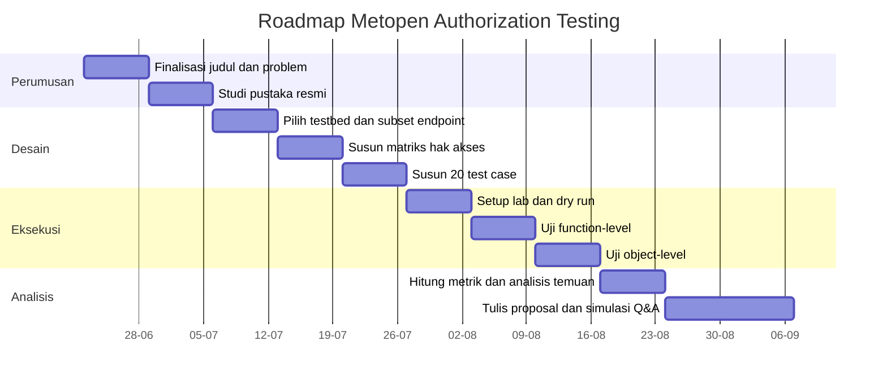

# README Metopen

# Evaluasi Otorisasi Level Fungsi dan Level Objek pada Aplikasi Web Multi-Role Menggunakan OWASP WSTG

> Dokumen ini adalah **blueprint kerja Metodologi Penelitian**.  
> Isinya bukan proposal final yang langsung diserahkan, tetapi pegangan utama untuk memahami topik, menjaga scope, menyusun Bab 1–3, membuat test case, mengumpulkan evidence, dan menjawab pertanyaan dosen.

---

## Status Dokumen

| Item | Isi |
|---|---|
| Topik besar | Web Application Security |
| Fokus | Authorization Testing |
| Risiko utama | Broken Access Control |
| Panduan utama | OWASP Web Security Testing Guide |
| Objek uji utama | Aplikasi web multi-role di lingkungan lokal/lab |
| Kandidat testbed | Self Order System Management, atau demo app kecil jika sistem utama terlalu besar |
| Luaran utama | Matriks hak akses, test case, evidence, metrik, analisis, dan rekomendasi mitigasi |
| Bukan luaran utama | Membuat aplikasi baru, mencari celah sebanyak-banyaknya, atau melakukan pentest umum |

---

## TL;DR

Penelitian ini ingin menjawab satu pertanyaan inti:

> **Apakah aplikasi web multi-role benar-benar menolak akses yang tidak semestinya pada level fungsi dan level objek?**

Contoh sederhananya:

| Kasus | Expected | Actual | Interpretasi |
|---|---|---|---|
| Kasir membuka halaman owner | Ditolak | Ditolak | Aman/compliant |
| Kasir membuka endpoint manajemen user owner | Ditolak | Berhasil | Broken Access Control |
| Customer melihat order milik sesi QR lain | Ditolak | Berhasil | Object-level authorization failure |
| Owner membuka laporan penjualan | Berhasil | Berhasil | Sesuai |

Jadi inti penelitian ini **bukan membuat aplikasi**, melainkan **mengevaluasi apakah aturan hak akses benar-benar ditegakkan oleh server**.

---

## Daftar Isi

1. [Inti Penelitian](#1-inti-penelitian)
2. [Judul dan Framing Final](#2-judul-dan-framing-final)
3. [Mengapa Ini Penelitian, Bukan Project Biasa](#3-mengapa-ini-penelitian-bukan-project-biasa)
4. [Kesesuaian dengan Metodologi Penelitian](#4-kesesuaian-dengan-metodologi-penelitian)
5. [Latar Belakang Masalah](#5-latar-belakang-masalah)
6. [Gap Penelitian](#6-gap-penelitian)
7. [Rumusan Masalah, Tujuan, Manfaat, dan Kontribusi](#7-rumusan-masalah-tujuan-manfaat-dan-kontribusi)
8. [Dasar Teori Singkat](#8-dasar-teori-singkat)
9. [Objek Penelitian dan Keputusan Testbed](#9-objek-penelitian-dan-keputusan-testbed)
10. [Scope dan Batasan](#10-scope-dan-batasan)
11. [Unit Analisis dan Definisi Operasional](#11-unit-analisis-dan-definisi-operasional)
12. [Metodologi Penelitian](#12-metodologi-penelitian)
13. [Matriks Hak Akses](#13-matriks-hak-akses)
14. [Rancangan Test Case](#14-rancangan-test-case)
15. [Evidence dan Dokumentasi Bukti](#15-evidence-dan-dokumentasi-bukti)
16. [Metrik Evaluasi](#16-metrik-evaluasi)
17. [Etika dan Legalitas](#17-etika-dan-legalitas)
18. [Risiko Penelitian dan Mitigasi](#18-risiko-penelitian-dan-mitigasi)
19. [Roadmap 12 Minggu](#19-roadmap-12-minggu)
20. [Pertanyaan Dosen Paling Strict](#20-pertanyaan-dosen-paling-strict)
21. [Checklist Sebelum Bimbingan](#21-checklist-sebelum-bimbingan)
22. [Referensi Utama](#22-referensi-utama)
23. [Kalimat Inti yang Harus Diingat](#23-kalimat-inti-yang-harus-diingat)

---

# 1. Inti Penelitian

## 1.1 Masalah Sederhananya

Banyak aplikasi web punya fitur seperti:

- login;
- role user;
- halaman admin;
- halaman kasir;
- halaman owner;
- tombol yang hanya muncul untuk role tertentu.

Namun, hal penting yang sering dilupakan adalah:

> **Tombol yang disembunyikan di frontend belum tentu berarti endpoint backend aman.**

Contoh:

- tombol “Kelola User” tidak muncul di akun cashier;
- tetapi cashier masih bisa mengirim request langsung ke `/api/internal/users`;
- jika backend tidak memeriksa role, request itu bisa berhasil.

Itulah masalah penelitian ini.

Penelitian ini menguji apakah aplikasi benar-benar melakukan validasi akses di sisi server, bukan hanya menyembunyikan menu di tampilan.

## 1.2 Dua Area yang Diuji

Penelitian ini fokus pada dua area.

### A. Otorisasi Level Fungsi

Ini menguji apakah role tertentu boleh mengakses fitur tertentu.

Contoh:

| Actor | Fungsi | Seharusnya |
|---|---|---|
| PUBLIC | Membuka endpoint internal order | Ditolak |
| CASHIER | Membuka manajemen user | Ditolak |
| CASHIER | Memproses pembayaran | Diizinkan |
| OWNER | Membuka laporan penjualan | Diizinkan |

Masalah yang dicari:

- user biasa mengakses fungsi admin;
- cashier mengakses fungsi owner;
- public mengakses endpoint internal;
- endpoint sensitif hanya dibatasi di frontend, bukan backend.

### B. Otorisasi Level Objek

Ini menguji apakah user/session tertentu boleh mengakses **resource tertentu**.

Contoh:

| Actor | Objek | Seharusnya |
|---|---|---|
| Customer sesi meja A | Order milik sesi meja A | Diizinkan |
| Customer sesi meja A | Order milik sesi meja B | Ditolak |
| Cashier | Order operasional | Diizinkan |
| Public tanpa session token | Tracking order | Ditolak |

Masalah yang dicari:

- IDOR;
- akses data milik session lain;
- manipulasi parameter ID;
- akses object tanpa validasi ownership/session.

---

# 2. Judul dan Framing Final

## 2.1 Judul Utama yang Direkomendasikan

> **Evaluasi Otorisasi Level Fungsi dan Level Objek pada Aplikasi Web Multi-Role Menggunakan OWASP Web Security Testing Guide**

Judul ini dipilih karena lebih tepat daripada judul yang terlalu mengunci pada RBAC.

## 2.2 Kenapa Tidak Memakai Judul “Evaluasi RBAC” Saja?

Karena penelitian ini tidak hanya menguji:

> “Role ini boleh akses fitur apa?”

Tetapi juga menguji:

> “User atau session ini boleh akses objek milik siapa?”

RBAC cocok untuk membahas role seperti `OWNER` dan `CASHIER`.  
Namun, object-level authorization membutuhkan pemeriksaan tambahan seperti:

- kepemilikan data;
- session token;
- QR token;
- relasi antara order dan order session;
- relasi antara meja dan QR token.

Karena itu, framing **function-level authorization** dan **object-level authorization** lebih presisi.

## 2.3 Alternatif Judul

| Versi | Judul | Catatan |
|---|---|---|
| Paling direkomendasikan | Evaluasi Otorisasi Level Fungsi dan Level Objek pada Aplikasi Web Multi-Role Menggunakan OWASP WSTG | Paling seimbang dan akademik |
| Lebih eksplisit cyber | Evaluasi Broken Access Control pada Aplikasi Web Multi-Role Menggunakan OWASP WSTG | Lebih mudah dipahami, tapi agak luas |
| Lebih konservatif | Analisis Kesesuaian Hak Akses pada Aplikasi Web Multi-Role Menggunakan OWASP WSTG | Lebih aman untuk dosen non-cyber |
| Jika memakai project SOS | Evaluasi Otorisasi Level Fungsi dan Level Objek pada Self Order System Management Menggunakan OWASP WSTG | Spesifik pada objek penelitian |

## 2.4 Kalimat Pitch ke Dosen

> Penelitian ini tidak berfokus pada pembuatan aplikasi atau penetration testing secara luas. Penelitian ini mengevaluasi apakah kontrol otorisasi level fungsi dan level objek pada aplikasi web multi-role benar-benar ditegakkan sesuai matriks hak akses ketika diuji menggunakan skenario Authorization Testing dari OWASP WSTG.

---

# 3. Mengapa Ini Penelitian, Bukan Project Biasa

## 3.1 Jika Ini Project Biasa

Project biasa biasanya berhenti pada:

- membuat aplikasi;
- membuat login;
- membuat dashboard;
- membuat role;
- membuat CRUD;
- aplikasi bisa berjalan.

Contoh kalimat project:

> “Saya membuat aplikasi self-order restoran dengan fitur owner, cashier, dan customer.”

Itu bagus sebagai project, tetapi belum cukup sebagai penelitian.

## 3.2 Jika Ini Penelitian

Penelitian harus bertanya:

> “Apakah mekanisme otorisasi pada aplikasi itu benar-benar bekerja sesuai aturan akses?”

Jadi yang diuji bukan sekadar aplikasi berjalan, tetapi **kesesuaian antara aturan akses yang seharusnya dan perilaku aktual aplikasi**.

## 3.3 Perbedaan Project dan Penelitian

| Aspek | Project | Penelitian ini |
|---|---|---|
| Fokus | Membuat aplikasi | Mengevaluasi kontrol otorisasi |
| Output | Aplikasi berjalan | Matriks, test case, evidence, metrik, analisis |
| Pertanyaan utama | “Aplikasinya bisa dipakai?” | “Akses yang tidak sah benar-benar ditolak?” |
| Bukti | Screenshot fitur | Request-response dan expected-vs-actual |
| Kontribusi | Produk/software | Evaluasi sistematis dan rekomendasi mitigasi |
| Risiko | Jadi tugas pembangunan aplikasi | Menjadi kajian evaluatif yang bisa dipertanggungjawabkan |

## 3.4 Posisi Aplikasi dalam Penelitian

Aplikasi web hanya dipakai sebagai:

> **testbed**

Artinya:

- aplikasi adalah tempat pengujian;
- aplikasi bukan tujuan utama;
- aplikasi bukan kontribusi ilmiah utama;
- aplikasi hanya membantu membuktikan metode evaluasi.

---

# 4. Kesesuaian dengan Metodologi Penelitian

## 4.1 Prinsip Metopen yang Dipenuhi

| Prinsip Metopen | Implementasi pada topik ini | Status |
|---|---|---|
| Penelitian harus berangkat dari masalah | Masalahnya adalah role/login tidak otomatis menjamin otorisasi server-side benar | Terpenuhi |
| Harus ada gap | Ada gap antara aturan akses ideal dan implementasi aktual | Terpenuhi |
| Harus punya tujuan penelitian | Mengevaluasi kesesuaian kontrol otorisasi | Terpenuhi |
| Harus sistematis | Menggunakan matriks akses, test case, evidence, dan metrik | Terpenuhi |
| Harus dapat diuji | Setiap test case punya expected dan actual | Terpenuhi |
| Software bukan tujuan utama | Aplikasi hanya testbed | Terpenuhi |
| Harus ada kontribusi pengetahuan | Menghasilkan hasil evaluasi, pola temuan, dan rekomendasi mitigasi | Terpenuhi |
| Harus ada batasan | Hanya authorization, bukan seluruh keamanan web | Terpenuhi |

## 4.2 Masalah Kehidupan vs Masalah Penelitian

| Jenis masalah | Bentuk pada topik ini |
|---|---|
| Masalah kehidupan | Aplikasi web bisa membocorkan data atau memberi akses tidak sah jika authorization lemah |
| Masalah penelitian | Belum diketahui apakah kontrol otorisasi pada objek uji sudah sesuai dengan matriks hak akses ketika diuji menggunakan OWASP WSTG |

Dengan kata lain:

> Masalah kehidupan memberi alasan kenapa topik ini penting.  
> Masalah penelitian memberi pertanyaan yang bisa diuji secara ilmiah.

---

# 5. Latar Belakang Masalah

Aplikasi web modern sering memiliki banyak role dan banyak jenis resource. Pada sistem restoran digital, misalnya, terdapat:

- customer/public;
- cashier;
- owner;
- order;
- table;
- QR token;
- transaction;
- report;
- user management;
- menu management.

Setiap actor tidak seharusnya memiliki hak akses yang sama. Customer hanya boleh membuat dan melacak order sesuai sesi atau QR token yang valid. Cashier boleh mengelola proses operasional seperti menerima order, menyajikan order, dan memproses pembayaran. Owner memiliki akses lebih luas seperti user management, laporan, meja, QR token, dan pengaturan sistem.

Masalah muncul ketika pembatasan akses hanya terlihat di frontend, tetapi tidak ditegakkan secara konsisten pada backend. Misalnya, menu owner tidak muncul untuk cashier, tetapi endpoint owner masih bisa dipanggil langsung melalui HTTP request. Pada kasus lain, customer mungkin dapat mengubah parameter order ID untuk melihat order milik sesi lain. Kondisi seperti ini termasuk dalam keluarga masalah Broken Access Control.

OWASP menempatkan Broken Access Control sebagai salah satu risiko utama keamanan aplikasi web. Bentuknya dapat berupa force browsing, parameter tampering, privilege escalation, IDOR, atau akses ke method sensitif tanpa validasi otorisasi yang tepat.

Karena itu, perlu dilakukan evaluasi sistematis terhadap kontrol otorisasi pada aplikasi web multi-role. Evaluasi ini dilakukan dengan menyusun matriks hak akses, menurunkannya menjadi test case, menjalankan pengujian request-response, lalu membandingkan hasil aktual dengan akses yang seharusnya.

---

# 6. Gap Penelitian

## 6.1 Gap Utama

Gap utama penelitian ini adalah:

> Banyak aplikasi web multi-role memiliki login dan role, tetapi belum tentu memiliki evaluasi sistematis yang membuktikan bahwa kontrol otorisasi level fungsi dan level objek benar-benar berjalan sesuai aturan akses.

## 6.2 Jenis Gap yang Dipakai

| Jenis gap | Relevansi pada penelitian ini |
|---|---|
| Practical knowledge gap | Secara praktik, developer sering membuat role/menu, tetapi belum tentu menguji server-side authorization secara sistematis |
| Methodological gap | OWASP WSTG sudah ada, tetapi perlu diterjemahkan menjadi matriks akses, test case, evidence, dan metrik pada studi kasus tertentu |
| Knowledge gap lokal | Pada konteks project pembelajaran/kampus, belum tentu ada dokumentasi evaluasi authorization yang rapi dan reproducible |
| Evidence gap | Digunakan hati-hati; hanya bisa diklaim jika ditemukan studi dengan hasil yang bertentangan |

## 6.3 Gap yang Tidak Boleh Diklaim Berlebihan

Jangan menulis:

> “Belum ada penelitian tentang Broken Access Control.”

Itu terlalu besar dan kemungkinan salah.

Tulis yang lebih aman:

> “Belum diketahui apakah mekanisme otorisasi pada objek uji telah sesuai dengan matriks hak akses ketika diuji secara sistematis menggunakan skenario Authorization Testing dari OWASP WSTG.”

---

# 7. Rumusan Masalah, Tujuan, Manfaat, dan Kontribusi

## 7.1 Rumusan Masalah

1. Bagaimana menyusun matriks hak akses pada aplikasi web multi-role yang menjadi objek penelitian?
2. Bagaimana menyusun test case otorisasi level fungsi dan level objek berdasarkan OWASP WSTG?
3. Apakah implementasi kontrol otorisasi pada aplikasi yang diuji sudah sesuai dengan matriks hak akses?
4. Temuan Broken Access Control apa saja yang muncul pada level fungsi dan level objek?
5. Rekomendasi mitigasi apa yang sesuai untuk memperbaiki temuan tersebut?

## 7.2 Tujuan Penelitian

| Tujuan | Penjelasan |
|---|---|
| Menyusun matriks hak akses | Menentukan actor mana boleh melakukan aksi apa pada resource tertentu |
| Menyusun test case | Menerjemahkan OWASP WSTG menjadi skenario uji yang bisa diulang |
| Mengevaluasi expected-vs-actual | Membandingkan akses yang seharusnya dengan respons aktual aplikasi |
| Mengidentifikasi temuan | Mengklasifikasikan temuan function-level dan object-level |
| Memberi rekomendasi | Menyusun mitigasi berdasarkan prinsip OWASP |

## 7.3 Manfaat Penelitian

| Pihak | Manfaat |
|---|---|
| Peneliti | Memahami authorization testing secara sistematis |
| Developer | Mendapat checklist dan evidence untuk mengevaluasi akses |
| Dosen/pembimbing | Mendapat topik yang jelas, terukur, dan sesuai Metopen |
| Pengguna sistem | Berpotensi mendapat sistem dengan kontrol akses lebih aman |
| Bidang Informatika | Menunjukkan contoh evaluasi keamanan web yang tidak berhenti pada “membuat aplikasi” |

## 7.4 Kontribusi Penelitian

Kontribusi penelitian ini **bukan framework global baru** dan **bukan tool pentest baru**.

Kontribusi yang aman dan realistis:

1. matriks hak akses pada aplikasi web multi-role;
2. daftar test case authorization yang reproducible;
3. evidence request-response;
4. klasifikasi hasil compliant, vulnerable, logic error, dan inconclusive;
5. metrik Authorization Compliance Rate dan Access Control Failure Rate;
6. rekomendasi mitigasi berdasarkan temuan.

---

# 8. Dasar Teori Singkat

## 8.1 Authentication vs Authorization

| Konsep | Pertanyaan utama | Contoh |
|---|---|---|
| Authentication | “Siapa kamu?” | Login username dan password |
| Authorization | “Kamu boleh melakukan apa?” | Cashier boleh melihat order, tetapi tidak boleh mengelola user |

Penelitian ini fokus pada **authorization**, bukan authentication.

## 8.2 Broken Access Control

Broken Access Control adalah kondisi ketika user dapat melakukan aksi di luar izin yang seharusnya, misalnya:

- mengakses endpoint admin;
- melihat data user lain;
- mengubah objek milik user lain;
- menjalankan fungsi bisnis di luar role;
- memanggil endpoint sensitif secara langsung.

## 8.3 Function-Level Authorization

Function-level authorization mengatur akses terhadap fungsi atau endpoint.

Contoh:

```text
CASHIER -> GET /api/internal/orders        -> allow
CASHIER -> GET /api/internal/users         -> deny
OWNER   -> GET /api/internal/users         -> allow
PUBLIC  -> GET /api/internal/orders        -> deny
```

## 8.4 Object-Level Authorization

Object-level authorization mengatur akses terhadap resource tertentu.

Contoh:

```text
Customer session A -> GET /api/public/orders/order-A -> allow
Customer session A -> GET /api/public/orders/order-B -> deny
```

## 8.5 IDOR / BOLA

IDOR atau Broken Object Level Authorization terjadi ketika aplikasi menerima identifier dari user, tetapi gagal memeriksa apakah user tersebut berhak mengakses objek yang diminta.

Contoh:

```text
GET /orders/123
GET /orders/124
```

Jika user hanya mengganti ID dan bisa melihat data milik orang lain, maka itu termasuk object-level authorization failure.

## 8.6 OWASP WSTG

OWASP Web Security Testing Guide dipakai sebagai panduan metode. Untuk penelitian ini, bagian yang paling relevan adalah:

| Kode | Nama | Relevansi |
|---|---|---|
| WSTG-ATHZ-02 | Testing for Bypassing Authorization Schema | Menguji apakah user dapat melewati aturan akses |
| WSTG-ATHZ-03 | Testing for Privilege Escalation | Menguji apakah user dapat naik privilege |
| WSTG-ATHZ-04 | Testing for Insecure Direct Object References | Menguji akses objek melalui manipulasi identifier |

---

# 9. Objek Penelitian dan Keputusan Testbed

## 9.1 Keputusan Praktis

Ada dua opsi testbed.

| Opsi | Keterangan | Rekomendasi |
|---|---|---|
| Opsi A | Menggunakan project Self Order System Management sebagai objek uji | Direkomendasikan jika sistem stabil dan scope dipersempit |
| Opsi B | Membuat demo app kecil khusus authorization testing | Backup jika project utama terlalu besar |

## 9.2 Apakah Project Self Order System Management Bisa Dipakai?

Bisa, dan secara akademik justru menarik, karena project ini sudah punya struktur multi-role yang nyata:

- `PUBLIC`;
- `CASHIER`;
- `OWNER`;
- public customer order melalui QR;
- internal order;
- user management;
- table management;
- report;
- QR token;
- payment;
- transaction.

Project ini juga sudah memiliki dokumen atau pola access matrix. Itu sangat membantu karena penelitian ini membutuhkan matriks hak akses.

Namun, ada satu syarat penting:

> Jangan menguji seluruh sistem. Ambil subset authorization yang jelas dan terbatas.

## 9.3 Subset SOS yang Direkomendasikan

Agar tidak melebar, subset yang disarankan:

| Area | Endpoint/fitur | Alasan dipilih |
|---|---|---|
| Auth | login, logout, profile | baseline authentication |
| Public order | validasi QR, buat order, tracking order | cocok untuk object-level/session-level access |
| Internal order | list, detail, accept, served, cancel | cocok untuk cashier-owner operational access |
| Payment | payment order | fungsi sensitif |
| User management | owner-only | cocok untuk function-level authorization |
| Reports | owner-only | cocok untuk function-level authorization |
| Table/QR management | owner-only | cocok untuk function + object access |

## 9.4 Scope SOS yang Tidak Perlu Diuji

Agar tidak berubah menjadi audit besar:

- upload file;
- backup/restore;
- full audit log;
- UI polish;
- code splitting frontend;
- performance;
- build/lint;
- SQL injection;
- XSS;
- CSRF;
- brute force.

## 9.5 Jika Project SOS Terlalu Besar

Gunakan strategi:

> Ambil **mini-version** atau **controlled subset** dari SOS.

Misalnya:

- hanya owner, cashier, public;
- hanya order, QR token, user management, report;
- hanya endpoint yang terkait authorization.

Dengan begitu, project tetap relevan, tetapi penelitian tetap realistis.

---

# 10. Scope dan Batasan

## 10.1 Termasuk Scope

| Aspek | Termasuk |
|---|---|
| Domain | Web Application Security |
| Fokus | Authorization Testing |
| Risiko | Broken Access Control |
| Tipe uji | Function-level dan object-level authorization |
| Objek | Satu aplikasi web multi-role |
| Metode | OWASP WSTG |
| Data | Request, response, status code, response body, perubahan state |
| Environment | Local/lab |

## 10.2 Di Luar Scope

| Di luar scope | Alasan |
|---|---|
| SQL Injection | Bukan fokus authorization |
| XSS | Bukan fokus penelitian |
| CSRF | Terlalu melebar untuk Metopen |
| Brute force | Fokusnya authentication, bukan authorization |
| Malware | Tidak relevan |
| Social engineering | Tidak relevan |
| Red teaming umum | Terlalu luas |
| Sistem publik tanpa izin | Tidak etis dan berisiko legal |
| Audit seluruh source code | Penelitian ini berbasis pengujian request-response |

---

# 11. Unit Analisis dan Definisi Operasional

## 11.1 Unit Analisis

Unit analisis penelitian:

```text
identity × role × endpoint × method × action × resource/session ownership
```

Contoh pada SOS:

```text
cashier × CASHIER × GET /api/internal/users × read × n/a
```

Expected:

```text
deny
```

Contoh object-level:

```text
customerSessionA × PUBLIC × GET /api/public/orders/{orderB} × read × sessionB
```

Expected:

```text
deny
```

## 11.2 Definisi Operasional

| Istilah | Definisi dalam penelitian |
|---|---|
| Identity | Akun atau sesi yang digunakan saat pengujian |
| Role | Hak akses kategori pengguna, misalnya PUBLIC, CASHIER, OWNER |
| Endpoint | URL API atau halaman yang diuji |
| Method | HTTP method: GET, POST, PATCH, DELETE |
| Action | Aksi bisnis: read, create, update, delete, pay, export |
| Resource ownership | Kepemilikan resource oleh user/session tertentu |
| Expected | Hasil yang seharusnya berdasarkan matriks hak akses |
| Actual | Hasil nyata dari response aplikasi |
| Compliant | Actual sesuai expected |
| Vulnerable | Expected deny, tetapi actual allow |
| Logic error | Expected allow, tetapi actual deny |
| Inconclusive | Bukti belum cukup atau environment bermasalah |

---

# 12. Metodologi Penelitian

## 12.1 Jenis Penelitian

Jenis penelitian:

> **Studi kasus evaluatif dengan pengujian teknis empiris.**

Artinya:

- hanya satu objek uji;
- pengujian dilakukan secara sistematis;
- hasilnya berupa evaluasi;
- data dikumpulkan dari request-response;
- analisis dilakukan dengan expected-vs-actual.

## 12.2 Alur Penelitian

1. Menentukan objek uji.
2. Mengidentifikasi role, endpoint, dan resource.
3. Menyusun matriks hak akses.
4. Menurunkan matriks menjadi test case.
5. Menyiapkan akun dan data dummy.
6. Menjalankan test case.
7. Menyimpan evidence.
8. Membandingkan expected dan actual.
9. Menghitung metrik.
10. Menyusun rekomendasi mitigasi.

## 12.3 Instrumen Penelitian

| Instrumen | Fungsi |
|---|---|
| Matriks hak akses | Menjadi sumber expected result |
| Test case sheet | Menjadi panduan eksekusi |
| Evidence template | Menstandarkan bukti |
| HTTP client | Menjalankan request |
| Browser DevTools / curl / Postman / Burp / ZAP | Alat bantu pengujian |
| Spreadsheet analisis | Menghitung metrik dan status |

Catatan:

> Tool hanya alat bantu. Data utama tetap expected access, actual access, dan evidence request-response.

---

# 13. Matriks Hak Akses

## 13.1 Matriks Umum untuk Project SOS

| Area | Endpoint/Fungsi | PUBLIC | CASHIER | OWNER |
|---|---|---:|---:|---:|
| Health | `GET /api/health` | allow | allow | allow |
| Auth | `POST /api/auth/login` | allow | allow | allow |
| Auth | `GET /api/auth/me` | deny | allow | allow |
| Public QR | `POST /api/public/qr/validate` | allow dengan QR valid | allow | allow |
| Public Menu | `GET /api/public/menu` | allow | allow | allow |
| Public Order | `POST /api/public/orders` | allow dengan session/QR valid | allow | allow |
| Public Tracking | `GET /api/public/orders/:id` | allow hanya dengan session token valid | allow | allow |
| Internal Orders | `GET /api/internal/orders` | deny | allow | allow |
| Internal Orders | `GET /api/internal/orders/:id` | deny | allow | allow |
| Internal Orders | `PATCH /api/internal/orders/:id/accept` | deny | allow | allow |
| Internal Orders | `PATCH /api/internal/orders/:id/served` | deny | allow | allow |
| Payment | `POST /api/internal/orders/:id/payments` | deny | allow | allow |
| Transactions | `GET /api/internal/transactions` | deny | allow | allow |
| Menu List | `GET /api/internal/menu-items` | deny | allow | allow |
| Menu Update Availability | `PATCH /api/internal/menu-items/:id` | deny | limited/availability only | allow |
| User Management | `/api/internal/users*` | deny | deny | allow |
| Reports | `/api/internal/reports*` | deny | deny | allow |
| Tables | `/api/internal/tables*` | deny | deny | allow |
| QR Management | `/api/internal/qr-tokens*` | deny | deny | allow |
| Audit Logs | `/api/internal/audit-logs*` | deny | deny | allow |

## 13.2 Catatan Penting Matriks

Matriks harus dibekukan sebelum eksekusi test case.

Jangan mengubah expected result setelah melihat actual result.

Jika ternyata aturan bisnis berubah, revisi matriks harus dicatat sebagai revisi desain, bukan diam-diam diganti.

---

# 14. Rancangan Test Case

## 14.1 Format Test Case

| Field | Keterangan |
|---|---|
| ID | Nomor test case |
| Category | Function-level atau object-level |
| Actor | Identitas yang digunakan |
| Role | Role actor |
| Endpoint | Endpoint yang diuji |
| Method | HTTP method |
| Resource/session owner | Pemilik resource/session |
| Expected | allow atau deny |
| Actual | hasil nyata |
| Status | compliant, vulnerable, logic error, inconclusive |
| Reproduction steps | langkah uji |
| Evidence file | file bukti |

## 14.2 Test Case Function-Level

| ID | Category | Actor | Endpoint | Method | Expected | Fokus |
|---|---|---|---|---|---|---|
| TC-F01 | Function-level | PUBLIC | `/api/internal/orders` | GET | deny | public tidak boleh akses internal |
| TC-F02 | Function-level | PUBLIC | `/api/internal/users` | GET | deny | public tidak boleh akses user management |
| TC-F03 | Function-level | CASHIER | `/api/internal/users` | GET | deny | cashier tidak boleh kelola user |
| TC-F04 | Function-level | CASHIER | `/api/internal/users` | POST | deny | cashier tidak boleh create user |
| TC-F05 | Function-level | CASHIER | `/api/internal/reports` | GET | deny | cashier tidak boleh akses reports owner |
| TC-F06 | Function-level | CASHIER | `/api/internal/tables` | POST | deny | cashier tidak boleh create table |
| TC-F07 | Function-level | CASHIER | `/api/internal/qr-tokens` | POST | deny | cashier tidak boleh generate QR |
| TC-F08 | Function-level | OWNER | `/api/internal/users` | GET | allow | positive control owner |
| TC-F09 | Function-level | OWNER | `/api/internal/reports` | GET | allow | positive control owner |
| TC-F10 | Function-level | CASHIER | `/api/internal/orders` | GET | allow | positive control cashier |

## 14.3 Test Case Object-Level / Session-Level

| ID | Category | Actor | Endpoint | Method | Resource/session owner | Expected | Fokus |
|---|---|---|---|---|---|---|---|
| TC-O01 | Object-level | PUBLIC session A | `/api/public/orders/{orderA}` | GET | session A | allow | customer tracking order sendiri |
| TC-O02 | Object-level | PUBLIC session A | `/api/public/orders/{orderB}` | GET | session B | deny | customer tidak boleh tracking order session lain |
| TC-O03 | Object-level | PUBLIC tanpa token | `/api/public/orders/{orderA}` | GET | session A | deny | tracking harus butuh session token |
| TC-O04 | Object-level | PUBLIC QR revoked | `/api/public/orders` | POST | revoked QR | deny | QR token dicabut tidak boleh dipakai |
| TC-O05 | Object-level | PUBLIC QR expired | `/api/public/orders` | POST | expired QR | deny | QR expired tidak valid |
| TC-O06 | Object-level | CASHIER | `/api/internal/orders/{orderId}/payments` | POST | order valid | allow | cashier boleh bayar order valid |
| TC-O07 | Object-level | CASHIER | `/api/internal/orders/{paidOrder}/payments` | POST | order sudah paid | deny/logic error | state transition harus valid |
| TC-O08 | Object-level | CASHIER | `/api/internal/orders/{cancelledOrder}/served` | PATCH | cancelled order | deny/logic error | tidak boleh serve cancelled order |
| TC-O09 | Object-level | CASHIER | `/api/internal/menu-items/{id}` | PATCH | menu item | allow limited | cashier hanya ubah availability |
| TC-O10 | Object-level | CASHIER | `/api/internal/menu-items/{id}` | PATCH | menu item | deny jika ubah price/name | cashier tidak boleh ubah field owner-only |

## 14.4 Total Minimum Test Case

Minimal:

```text
10 function-level test cases
10 object-level/session-level test cases
Total = 20 test cases
```

Jumlah ini cukup realistis untuk Metopen dan masih bisa dijelaskan kepada dosen.

---

# 15. Evidence dan Dokumentasi Bukti

## 15.1 Kenapa Evidence Penting?

Evidence membuat penelitian:

- bisa diverifikasi;
- bisa direplikasi;
- tidak hanya klaim;
- tidak bergantung pada “katanya aplikasi rentan”;
- cocok untuk expected-vs-actual analysis.

## 15.2 Template Evidence

````markdown
# Evidence TC-F03

## Metadata

| Field | Value |
|---|---|
| Test Case ID | TC-F03 |
| Category | Function-level authorization |
| Actor | cashier01 |
| Role | CASHIER |
| Endpoint | /api/internal/users |
| Method | GET |
| Expected | deny |
| Timestamp | 2026-06-18T20:13:00+07:00 |
| Environment | local-lab |

## Reproduction Steps

1. Login sebagai cashier.
2. Ambil bearer token.
3. Kirim request `GET /api/internal/users`.
4. Simpan request dan response.
5. Bandingkan hasil dengan matriks hak akses.

## Request

```bash
curl -i \
  -X GET "http://localhost:5000/api/internal/users" \
  -H "Authorization: Bearer <redacted>" \
  -H "Accept: application/json"
```

## Response

```http
HTTP/1.1 403 Forbidden
Content-Type: application/json
```

## Response Snippet

```json
{
  "success": false,
  "message": "Forbidden"
}
```

## Interpretation

| Item | Result |
|---|---|
| Expected | deny |
| Actual | deny |
| Status | Compliant |
| Notes | Cashier tidak dapat mengakses user management. |
````

## 15.3 Naming Convention Evidence

```text
evidence/
├── TC-F01.md
├── TC-F02.md
├── TC-F03.md
├── TC-O01.md
├── TC-O02.md
└── screenshots/
    ├── TC-F03.png
    └── TC-O02.png
```

## 15.4 Data yang Harus Disamarkan

Selalu samarkan:

- bearer token;
- session token;
- JWT;
- password;
- secret;
- database URL;
- data pribadi;
- QR raw token jika dianggap sensitif.

Gunakan:

```text
<redacted>
```

---

# 16. Metrik Evaluasi

## 16.1 Authorization Compliance Rate

Mengukur berapa persen test case yang actual-nya sesuai expected.

```text
ACR = (jumlah compliant / total test case valid) × 100%
```

## 16.2 Access Control Failure Rate

Mengukur seberapa sering aplikasi gagal menolak akses yang seharusnya ditolak.

```text
ACFR = (jumlah expected deny tetapi actual allow / total expected deny) × 100%
```

## 16.3 Function-Level Failure Rate

```text
FLFR = (jumlah vulnerable function-level / total test case function-level) × 100%
```

## 16.4 Object-Level Failure Rate

```text
OLFR = (jumlah vulnerable object-level / total test case object-level) × 100%
```

## 16.5 Evidence Completeness Rate

```text
ECR = (jumlah evidence lengkap / total test case dieksekusi) × 100%
```

## 16.6 Contoh Perhitungan

Misal:

```text
Total test case valid = 20
Compliant = 17
Expected deny = 14
Expected deny tetapi actual allow = 3
```

Maka:

```text
ACR  = (17 / 20) × 100% = 85%
ACFR = (3 / 14) × 100% = 21,43%
```

Interpretasi:

| Hasil | Makna |
|---|---|
| ACR tinggi | kontrol otorisasi cukup konsisten |
| ACFR tinggi | ada risiko Broken Access Control |
| FLFR tinggi | banyak masalah di akses fitur/endpoint |
| OLFR tinggi | banyak masalah di akses resource/session |
| ECR rendah | dokumentasi bukti belum cukup kuat |

---

# 17. Etika dan Legalitas

## 17.1 Prinsip Etika

Penelitian ini hanya boleh dilakukan pada:

- aplikasi milik sendiri;
- aplikasi lokal/lab;
- project yang memang kamu punya izin uji;
- data dummy.

Tidak boleh dilakukan pada:

- sistem publik tanpa izin;
- sistem kampus tanpa izin;
- aplikasi bisnis nyata tanpa izin;
- data user nyata.

## 17.2 Aturan Evidence

| Item | Aturan |
|---|---|
| Token | Harus disamarkan |
| Password | Tidak boleh ditampilkan |
| Data pribadi | Tidak boleh dipakai |
| Screenshot | Jangan memuat secret |
| Repository | Jangan commit `.env` |
| Laporan | Jangan mempublikasikan detail eksploitasi sensitif tanpa konteks |

## 17.3 Kalimat Etika untuk Proposal

> Seluruh pengujian dilakukan pada lingkungan lokal/lab dengan data dummy. Penelitian tidak melakukan pengujian terhadap sistem publik atau sistem pihak ketiga tanpa izin. Bukti teknis yang mengandung token, credential, atau informasi sensitif akan disamarkan.

---

# 18. Risiko Penelitian dan Mitigasi

| Risiko | Dampak | Mitigasi |
|---|---|---|
| Scope melebar ke semua OWASP Top 10 | Penelitian terlalu besar | Kunci hanya pada authorization |
| Terlalu fokus coding | Jadi project, bukan penelitian | Aplikasi hanya testbed |
| Project SOS terlalu besar | Waktu habis di memahami semua fitur | Ambil subset endpoint |
| Tidak ditemukan celah | Dianggap gagal | Jelaskan bahwa hasil compliant tetap valid |
| Evidence tidak rapi | Sulit diverifikasi | Gunakan template evidence |
| Dosen bingung RBAC vs ownership | Framing lemah | Gunakan istilah function-level dan object-level |
| Environment error | Test case gagal bukan karena authorization | Pisahkan status inconclusive |
| Token/secret bocor | Masalah etika | Redact semua secret |

---

# 19. Roadmap 12 Minggu

| Minggu | Target | Output |
|---|---|---|
| 1 | Finalisasi judul, problem, dan gap | Judul final + problem statement |
| 2 | Studi pustaka OWASP, WSTG, Authorization Cheat Sheet, NIST | Daftar referensi |
| 3 | Tentukan testbed: SOS subset atau demo app | Keputusan objek uji |
| 4 | Inventarisasi role, endpoint, resource | Endpoint inventory |
| 5 | Susun matriks hak akses | `access-matrix.md/csv` |
| 6 | Susun 20 test case | `testcases.md/csv` |
| 7 | Siapkan akun, data dummy, dan environment | Local lab siap |
| 8 | Dry run 5 test case | Evidence awal |
| 9 | Eksekusi seluruh function-level test | Evidence function-level |
| 10 | Eksekusi seluruh object-level test | Evidence object-level |
| 11 | Hitung metrik dan analisis temuan | ACR, ACFR, FLFR, OLFR |
| 12 | Tulis proposal ringkas dan simulasi tanya jawab | Draft proposal siap bimbingan |

## 19.1 Mermaid Gantt



---

# 20. Pertanyaan Dosen Paling Strict

| Pertanyaan | Jawaban yang disarankan |
|---|---|
| Ini penelitian atau cuma pentest? | Ini studi kasus evaluatif. Pengujian teknis hanya instrumen untuk membandingkan expected access dan actual access. |
| Kenapa tidak semua OWASP Top 10 diuji? | Karena rumusan masalah fokus pada authorization. Menguji semua kategori akan membuat scope terlalu luas. |
| Kenapa memakai OWASP WSTG? | Karena WSTG menyediakan panduan spesifik untuk Authorization Testing, termasuk bypass schema, privilege escalation, dan IDOR. |
| Kenapa bukan RBAC saja? | Karena penelitian ini juga menguji ownership/session pada resource tertentu, bukan hanya role. |
| Kenapa pakai satu aplikasi? | Karena unit analisisnya bukan jumlah aplikasi, tetapi kombinasi role, endpoint, method, action, dan ownership. |
| Kalau tidak ada celah, apakah gagal? | Tidak. Hasil compliant tetap valid sebagai hasil evaluasi kesesuaian hak akses. |
| Apakah aplikasinya kontribusi penelitian? | Tidak. Aplikasi hanya testbed. Kontribusi utamanya adalah matriks, test case, evidence, metrik, dan rekomendasi. |
| Bagaimana menentukan vulnerable? | Jika expected deny tetapi actual allow, atau aksi terlarang berhasil dieksekusi. |
| Bagaimana menjaga etika? | Uji hanya di local/lab, gunakan data dummy, dan samarkan token/secret. |
| Kenapa project SOS layak jadi testbed? | Karena memiliki multi-role nyata: public, cashier, owner; serta endpoint public, internal, dan owner-only yang cocok untuk authorization testing. |
| Apa bedanya function-level dan object-level? | Function-level menguji akses ke fitur/endpoint. Object-level menguji akses ke resource tertentu berdasarkan ownership/session. |
| Kenapa harus ada evidence request-response? | Agar hasil dapat diverifikasi dan direplikasi, bukan sekadar klaim. |

---

# 21. Checklist Sebelum Bimbingan

## 21.1 Checklist Topik

- [ ] Judul sudah final.
- [ ] Problem statement sudah jelas.
- [ ] Gap tidak overclaim.
- [ ] Scope hanya authorization.
- [ ] Aplikasi diposisikan sebagai testbed.
- [ ] Objek uji sudah dipilih.
- [ ] Ada alasan kenapa objek uji layak.

## 21.2 Checklist Metode

- [ ] Matriks hak akses sudah dibuat.
- [ ] 20 test case sudah disusun.
- [ ] Expected result sudah ditentukan sebelum pengujian.
- [ ] Template evidence sudah siap.
- [ ] Metrik ACR dan ACFR sudah didefinisikan.
- [ ] Status compliant/vulnerable/logic error/inconclusive sudah jelas.

## 21.3 Checklist Etika

- [ ] Lingkungan uji lokal/lab.
- [ ] Data dummy.
- [ ] Token disamarkan.
- [ ] Tidak menguji sistem publik.
- [ ] Tidak memuat credential pada laporan.
- [ ] `.env` tidak masuk repository.

## 21.4 Checklist Proposal Ringkas

- [ ] Latar belakang 2–4 paragraf.
- [ ] Gap penelitian 1–2 paragraf.
- [ ] Rumusan masalah 3–5 poin.
- [ ] Tujuan penelitian 3–5 poin.
- [ ] Metode ringkas.
- [ ] Objek uji jelas.
- [ ] Unit analisis jelas.
- [ ] Output penelitian jelas.
- [ ] Referensi resmi dicantumkan.

---

# 22. Referensi Utama

| Sumber | Fungsi |
|---|---|
| OWASP Top 10:2025 A01 Broken Access Control | Urgensi masalah |
| OWASP Web Security Testing Guide v4.2 | Metode pengujian |
| WSTG-ATHZ-02 Testing for Bypassing Authorization Schema | Function-level authorization |
| WSTG-ATHZ-03 Testing for Privilege Escalation | Vertical privilege escalation |
| WSTG-ATHZ-04 Testing for Insecure Direct Object References | Object-level authorization / IDOR |
| OWASP Authorization Cheat Sheet | Prinsip mitigasi authorization |
| OWASP ASVS | Verifikasi kontrol keamanan aplikasi |
| NIST RBAC | Dasar konseptual role-based access control |
| NIST ABAC | Dasar konseptual attribute-based access control |
| Dokumentasi project SOS | Objek uji dan access matrix lokal |

## 22.1 Link Referensi Resmi

- https://owasp.org/Top10/2025/A01_2025-Broken_Access_Control/
- https://owasp.org/www-project-web-security-testing-guide/
- https://owasp.org/www-project-web-security-testing-guide/v42/
- https://owasp.org/www-project-web-security-testing-guide/v42/4-Web_Application_Security_Testing/05-Authorization_Testing/
- https://cheatsheetseries.owasp.org/cheatsheets/Authorization_Cheat_Sheet.html
- https://owasp.org/www-project-application-security-verification-standard/
- https://csrc.nist.gov/projects/role-based-access-control
- https://csrc.nist.gov/projects/attribute-based-access-control

---

# 23. Kalimat Inti yang Harus Diingat

> **Penelitian ini tidak bertujuan membuat aplikasi dan tidak bertujuan melakukan pentest umum. Penelitian ini bertujuan mengevaluasi apakah kontrol otorisasi level fungsi dan level objek pada aplikasi web multi-role benar-benar ditegakkan sesuai matriks hak akses ketika diuji menggunakan OWASP Web Security Testing Guide.**

Kalimat ini harus konsisten muncul di:

- README;
- proposal;
- slide presentasi;
- jawaban saat bimbingan;
- jawaban saat ditanya dosen.

---

# 24. Versi Proposal Ringkas

Bagian ini dapat dipakai sebagai kerangka awal proposal 2–4 halaman.

## Judul

**Evaluasi Otorisasi Level Fungsi dan Level Objek pada Aplikasi Web Multi-Role Menggunakan OWASP Web Security Testing Guide**

## Latar Belakang Ringkas

Aplikasi web multi-role membutuhkan kontrol otorisasi yang konsisten agar setiap actor hanya dapat mengakses fungsi dan resource sesuai haknya. Keberadaan login dan role belum tentu menjamin bahwa otorisasi telah diterapkan dengan benar pada setiap endpoint di sisi server. Pada aplikasi seperti sistem self-order restoran, terdapat beberapa actor seperti public customer, cashier, dan owner yang memiliki batas akses berbeda terhadap order, pembayaran, user management, laporan, meja, dan QR token.

Masalah Broken Access Control dapat terjadi ketika pengguna berhasil mengakses fungsi atau objek di luar hak yang seharusnya, misalnya cashier mengakses endpoint owner atau customer melihat order milik session lain. Oleh karena itu, diperlukan evaluasi sistematis terhadap kontrol otorisasi level fungsi dan level objek menggunakan panduan OWASP WSTG.

## Rumusan Masalah Ringkas

1. Bagaimana menyusun matriks hak akses pada aplikasi web multi-role?
2. Bagaimana menyusun test case otorisasi berdasarkan OWASP WSTG?
3. Apakah implementasi kontrol otorisasi sudah sesuai dengan matriks hak akses?
4. Temuan apa saja yang muncul pada function-level dan object-level authorization?

## Tujuan Ringkas

1. Menyusun matriks hak akses.
2. Menyusun test case authorization.
3. Mengevaluasi expected access dan actual access.
4. Mengidentifikasi temuan Broken Access Control.
5. Memberikan rekomendasi mitigasi.

## Metode Ringkas

Penelitian ini menggunakan studi kasus evaluatif dengan pengujian teknis empiris. Unit analisis berupa kombinasi identity, role, endpoint, method, action, dan resource/session ownership. Pengujian dilakukan dengan membandingkan expected access berdasarkan matriks hak akses terhadap actual access berdasarkan response aplikasi. Hasil diklasifikasikan menjadi compliant, vulnerable, logic error, atau inconclusive, lalu dihitung menggunakan Authorization Compliance Rate dan Access Control Failure Rate.

---

# 25. Catatan Final untuk Eksekusi

Jangan mulai dari coding.

Urutan yang benar:

1. kunci judul;
2. kunci objek uji;
3. buat access matrix;
4. buat test case;
5. siapkan evidence template;
6. baru eksekusi pengujian.

Kalau urutan ini dibalik, penelitian mudah berubah menjadi project coding biasa.

