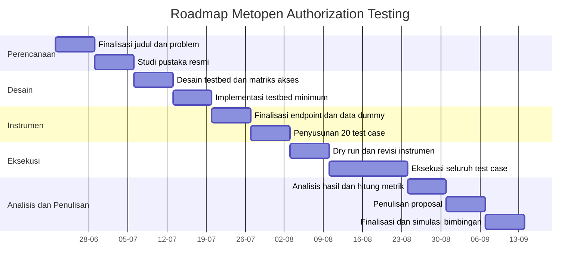

# README Metopen  
## Evaluasi Kontrol Otorisasi Level Fungsi dan Level Objek pada Aplikasi Web Multi-Role Menggunakan OWASP Web Security Testing Guide

## Ringkasan Eksekutif

Penelitian ini berfokus pada **evaluasi kontrol otorisasi** pada aplikasi web multi-role, khususnya pada dua area yang paling penting dan paling realistis untuk diteliti pada level sarjana: **otorisasi level fungsi** dan **otorisasi level objek**. Dasar urgensinya kuat. OWASP menempatkan **Broken Access Control** sebagai **A01:2025**, dan pada data yang mereka rangkum, **100% aplikasi yang diuji** memiliki sebagian bentuk broken access control. OWASP juga menyebut bentuk-bentuk masalah yang sangat dekat dengan topik ini, seperti **force browsing**, **parameter tampering**, **IDOR**, **missing access control** pada method seperti POST/PUT/DELETE, dan **privilege escalation**. citeturn2view0turn6view1turn6view3turn6view4

Secara metodologis, penelitian ini **bukan penelitian tentang membuat aplikasi**, dan **bukan penetration testing umum**. Aplikasi web diposisikan hanya sebagai **testbed** untuk menguji apakah aturan hak akses yang sudah didefinisikan benar-benar ditegakkan pada sisi server. Posisi ini sengaja dipilih agar sesuai dengan prinsip Metodologi Penelitian pada transkrip video yang kamu kirim: penelitian harus berangkat dari **masalah penelitian**, harus menghasilkan **kontribusi pengetahuan**, dan dalam Informatika **software bukan tujuan utama**, melainkan alat bantu atau testbed untuk menguji ide dan metode. fileciteturn0file4

Arah ini juga selaras dengan review mendalam sebelumnya: topik ini dinilai layak, tetapi harus diframing sebagai **evaluasi otorisasi level fungsi dan level objek**, bukan sekadar RBAC murni, karena pengujian yang kamu rancang jelas mencakup role **dan** ownership resource. fileciteturn0file2 fileciteturn0file3

**Output penelitian** yang diharapkan bukan aplikasi baru, melainkan:  
1. matriks hak akses;  
2. 20 test case otorisasi yang reproducible;  
3. bukti teknis request-response;  
4. hasil evaluasi **expected vs actual access**;  
5. metrik kepatuhan otorisasi;  
6. rekomendasi mitigasi.  

Dengan demikian, kontribusi penelitian ini bersifat **evaluatif**, yaitu menunjukkan apakah implementasi otorisasi pada objek uji **sudah sesuai** atau **belum sesuai** dengan aturan hak akses yang seharusnya.

## Landasan Penelitian dan Kesesuaian dengan Metopen

### Masalah Penelitian yang Diangkat

Masalah penelitian ini adalah bahwa **keberadaan login dan role tidak otomatis menjamin bahwa otorisasi ditegakkan dengan benar pada sisi server**. Dalam praktik pengembangan aplikasi web, pembatasan akses sering terlihat pada antarmuka, tetapi tidak selalu diterapkan secara konsisten pada endpoint, aksi, dan resource. Akibatnya, pengguna dapat membuka fungsi admin, mengakses data pengguna lain, atau memodifikasi objek yang bukan miliknya. Hal ini sejalan dengan deskripsi OWASP tentang access control failures, yang dapat menyebabkan pengungkapan, perubahan, atau penghancuran data tanpa izin, serta pelaksanaan fungsi bisnis di luar batas izin pengguna. citeturn2view0turn5view6

### Gap Penelitian

Gap penelitian yang diangkat bukan “belum ada penelitian tentang Broken Access Control”, karena itu tidak benar. Gap yang lebih tepat adalah:

> Banyak aplikasi web multi-role mengklaim sudah memiliki pembagian hak akses melalui role, tetapi belum tentu ada **evaluasi sistematis** terhadap apakah kontrol otorisasi benar-benar bekerja pada level fungsi dan level objek.

OWASP WSTG v4.2 memang menyediakan keluarga pengujian untuk **Authorization Testing**, khususnya pada **Bypassing Authorization Schema**, **Privilege Escalation**, dan **Insecure Direct Object References**, tetapi panduan itu tetap perlu diterjemahkan menjadi **matriks hak akses**, **test case**, dan **evidence sheet** yang konkret pada satu studi kasus aplikasi. citeturn6view0turn6view1turn6view3turn6view4

### Klaim Metopen dari Transkrip yang Sudah Terpenuhi

| Prinsip dalam transkrip video Metopen | Implementasi dalam penelitian ini | Status |
|---|---|---|
| Penelitian harus berangkat dari **masalah penelitian**, bukan sekadar minat pribadi | Masalah diformulasikan sebagai ketidaksesuaian antara role/login dengan penegakan otorisasi server-side | Terpenuhi |
| Penelitian harus punya **kontribusi pengetahuan** | Output berupa evaluasi, temuan, metrik, dan rekomendasi mitigasi; bukan sekadar aplikasi | Terpenuhi |
| **Software bukan tujuan utama**, hanya testbed | Aplikasi diposisikan sebagai objek uji untuk menguji otorisasi | Terpenuhi |
| Penelitian harus **sistematis, terukur, dan dapat diulang** | Ada unit analisis, template test case, evidence, metrik, dan roadmap | Terpenuhi |
| Masalah penelitian harus muncul dari **gap** antara kondisi ideal dan nyata | Ideal: hak akses ditegakkan; nyata: role/UI belum tentu berarti authorization benar | Terpenuhi |
| Penelitian Informatika tidak boleh berhenti pada “membuat software” | Hasil utama adalah evaluasi access control, bukan implementasi web | Terpenuhi |

Semua poin di atas konsisten dengan isi transkrip yang kamu kirim tentang salah kaprah penelitian Informatika dan posisi software sebagai testbed, bukan tujuan utama. fileciteturn0file4

### Posisi Judul yang Dipilih

Judul yang dipakai dalam README ini adalah:

> **Evaluasi Kontrol Otorisasi Level Fungsi dan Level Objek pada Aplikasi Web Multi-Role Menggunakan OWASP Web Security Testing Guide**

Judul ini dipilih karena lebih presisi daripada judul yang terlalu mengunci pada **RBAC**. OWASP Authorization Cheat Sheet justru menyarankan untuk mempertimbangkan **ABAC** dan **ReBAC** daripada RBAC murni dalam banyak konteks software engineering modern, karena kontrol akses pada aplikasi web sering melibatkan **atribut**, **konteks**, dan **relasi kepemilikan objek**. citeturn5view4turn5view2

## Rumusan Penelitian

### Pertanyaan Penelitian

1. Bagaimana aturan hak akses pada aplikasi web multi-role yang dijadikan objek penelitian dapat dipetakan ke dalam matriks hak akses yang eksplisit?
2. Bagaimana menyusun skenario pengujian otorisasi level fungsi dan level objek berdasarkan OWASP WSTG?
3. Apakah implementasi aktual otorisasi pada aplikasi yang diuji sudah sesuai dengan hak akses yang seharusnya?
4. Temuan broken access control apa saja yang muncul, dan bagaimana rekomendasi mitigasinya?

### Tujuan Penelitian

| Tujuan | Penjelasan |
|---|---|
| Menyusun matriks hak akses | Menetapkan siapa boleh melakukan apa terhadap resource mana |
| Menyusun test case authorization | Menerjemahkan WSTG menjadi pengujian yang bisa diulang |
| Mengevaluasi expected vs actual access | Menilai apakah aplikasi patuh terhadap aturan akses |
| Mengidentifikasi kelemahan otorisasi | Mencatat temuan pada level fungsi dan level objek |
| Memberikan rekomendasi mitigasi | Menyusun perbaikan berdasarkan temuan dan panduan OWASP |

### Definisi Operasional

| Istilah | Definisi operasional |
|---|---|
| **Broken Access Control** | Kondisi ketika pengguna dapat membaca, membuat, mengubah, atau menghapus fungsi/data di luar izin yang seharusnya diberikan. Kriteria ini diambil dari cakupan OWASP A01:2025. citeturn2view0 |
| **Otorisasi level fungsi** | Kontrol akses terhadap **fitur atau endpoint** berdasarkan role atau level privilege, misalnya hanya admin yang boleh membuka `/admin/users`. Ini beririsan dengan vertical privilege escalation dan authorization bypass. citeturn6view1turn6view3 |
| **Otorisasi level objek** | Kontrol akses terhadap **resource tertentu** berdasarkan kepemilikan atau relasi, misalnya `userA` hanya boleh mengakses `/tasks/{id}` miliknya sendiri. Ini beririsan dengan IDOR dan horizontal access violation. citeturn6view4turn6view5 |
| **Vulnerable** | Status diberikan bila **expected = deny** tetapi **actual = allow**, atau bila aksi pada objek/fungsi yang seharusnya ditolak ternyata berhasil dieksekusi |
| **Compliant** | Status diberikan bila **expected = actual**, khususnya ketika akses yang seharusnya ditolak memang ditolak, dan akses yang seharusnya diizinkan memang diizinkan |
| **Logic error** | Status ketika expected = allow tetapi actual = deny, sehingga bukan BAC, tetapi ada kesalahan implementasi terhadap rule |
| **Testbed** | Aplikasi yang dipakai untuk menguji metode evaluasi; **bukan kontribusi utama penelitian** |

### Unit Analisis

Unit analisis penelitian ini adalah kombinasi berikut:

```text
identity × role × endpoint × method × action × resource ownership
```

Contoh unit analisis:

```text
userA × USER × GET /tasks/200 × read × owner=userB
```

Struktur ini dipilih karena langsung sesuai dengan prinsip OWASP Authorization Testing, yang menilai request konkret terhadap fungsi, privilege, dan objek. citeturn6view0turn6view3turn6view4

## Keputusan Testbed, Scope, dan Batasan

### Keputusan Objek Uji

**Keputusan final: gunakan self-built demo app sederhana sebagai testbed utama.**

Alasannya:

1. hak akses bisa didefinisikan sejak awal secara eksplisit;
2. role, endpoint, data, dan ownership dapat dikontrol penuh;
3. pengujian legal, etis, dan reproducible;
4. scope lebih kecil dan aman untuk Metopen;
5. dosen lebih mudah melihat hubungan antara rule akses dan hasil uji.

Pilihan ini juga diperkuat oleh review sebelumnya yang menilai topik ini sangat layak asal objek uji dikunci dan aplikasi diposisikan sebagai **testbed**, bukan hasil utama. fileciteturn0file2 fileciteturn0file3

### Catatan tentang Proyek yang Sudah Kamu Miliki

Dokumen review proyek yang kamu unggah menunjukkan bahwa proyek **Self Order System Management** yang kamu kerjakan sekarang **sudah memiliki pola multi-role yang nyata**, baik pada frontend maupun backend. Frontend menunjukkan pemisahan area **owner**, **cashier**, dan **customer/public**; backend bahkan memiliki **API access matrix** yang memisahkan akses **PUBLIC**, **CASHIER**, dan **OWNER** pada kelompok endpoint berbeda. Itu membuktikan bahwa kamu sudah punya landasan praktis untuk membangun testbed kecil dengan pola kontrol akses yang benar. fileciteturn0file0 fileciteturn0file1

Namun, untuk kepentingan Metopen, objek utama **tetap direkomendasikan** berupa demo app yang lebih kecil daripada sistem produksi/proyek kelasmu saat ini. Tujuannya agar penelitian tidak melebar menjadi audit sistem besar.

### Spesifikasi Testbed yang Direkomendasikan

| Komponen | Rekomendasi |
|---|---|
| Nama kerja | `DemoAuthApp` / `TaskHub` |
| Role minimum | `guest`, `user`, `admin` |
| Resource minimum | `tasks`, `profiles`, `reports` |
| Aturan ownership | `task.owner_id = user.id` |
| Fitur minimum | login, logout, dashboard user, dashboard admin, daftar task, detail task, edit/delete task, profile, manajemen user admin |
| Akun uji | guest, userA, userB, admin |
| Data | seluruhnya data dummy |
| Environment | lokal, lebih baik containerized atau minimal terpisah frontend-backend |

### Catatan Deployment

Deployment cukup dibuat sederhana dan stabil. Rekomendasi setup:

```text
Frontend: React/Vite atau Laravel Blade sederhana
Backend : Express/Laravel/Django sederhana
DB      : PostgreSQL / MySQL / SQLite
Env     : Lokal, bisa dengan Docker Compose atau manual
```

Jika kamu ingin mencontoh pola deployment dari proyek yang sudah ada, review backend yang kamu upload menunjukkan bahwa kamu sudah terbiasa dengan struktur backend Node/Express, Prisma, dan Dockerfile. Ini bisa dijadikan referensi teknis, tetapi **penelitian tidak wajib memakai stack yang sama**, selama testbed mendukung role, endpoint, dan object ownership yang jelas. fileciteturn0file1

### Scope Penelitian

| Aspek | Termasuk |
|---|---|
| Domain | Web Application Security |
| Fokus | Authorization Testing |
| Objek | 1 aplikasi web multi-role |
| Kategori uji | function-level authorization dan object-level authorization |
| Metode | OWASP WSTG v4.2 Authorization Testing |
| Teknik | pengujian manual request-response, dibantu tool jika perlu |
| Data | status code, response body, perubahan state, bukti request-response |

### Batasan yang Ketat

| Tidak dibahas | Alasan |
|---|---|
| SQL Injection | di luar scope access control |
| XSS | di luar scope access control |
| CSRF | di luar scope utama agar penelitian tidak melebar |
| Brute force / auth bypass | penelitian ini fokus pada authorization, bukan authentication |
| Malware / reverse engineering | tidak relevan dengan object penelitian |
| Sistem publik / pihak ketiga | masalah etika dan legal |
| Red teaming umum | terlalu besar untuk Metopen semester awal |

### Sumber Resmi yang Wajib Disitasi di Proposal

| Sumber | Fungsi | Tautan resmi |
|---|---|---|
| OWASP Top 10:2025 A01 Broken Access Control | urgensi dan ruang masalah | https://owasp.org/Top10/2025/A01_2025-Broken_Access_Control/ |
| OWASP WSTG v4.2 Authorization Testing | dasar metode | https://owasp.org/www-project-web-security-testing-guide/v42/4-Web_Application_Security_Testing/05-Authorization_Testing/README |
| WSTG-ATHZ-02 | bypassing authorization schema | https://owasp.org/www-project-web-security-testing-guide/v42/4-Web_Application_Security_Testing/05-Authorization_Testing/02-Testing_for_Bypassing_Authorization_Schema |
| WSTG-ATHZ-03 | privilege escalation | https://owasp.org/www-project-web-security-testing-guide/v42/4-Web_Application_Security_Testing/05-Authorization_Testing/03-Testing_for_Privilege_Escalation |
| WSTG-ATHZ-04 | IDOR | https://owasp.org/www-project-web-security-testing-guide/v42/4-Web_Application_Security_Testing/05-Authorization_Testing/04-Testing_for_Insecure_Direct_Object_References |
| OWASP Authorization Cheat Sheet | prinsip desain dan mitigasi | https://cheatsheetseries.owasp.org/cheatsheets/Authorization_Cheat_Sheet.html |
| OWASP ASVS | dasar kontrol teknis dan verifikasi | https://owasp.org/www-project-application-security-verification-standard/ |
| NIST RBAC | dasar model RBAC | https://csrc.nist.gov/projects/role-based-access-control |
| NIST ABAC | dasar model berbasis atribut | https://csrc.nist.gov/projects/attribute-based-access-control |

Catatan penting: halaman NIST RBAC secara resmi ditandai sebagai **archived project**, sehingga tetap baik untuk dasar konseptual, tetapi untuk praktik aplikasi web modern, OWASP Authorization Cheat Sheet dan WSTG lebih relevan. citeturn5view0turn5view1turn5view2

## Rancangan Pengujian, Bukti, dan Analisis

### Matriks Hak Akses Dasar

Sebelum membuat test case, matriks hak akses inti harus ditetapkan.

| Fungsi / Resource | guest | userA/userB | admin |
|---|---|---|---|
| Login | boleh | boleh | boleh |
| Dashboard user | tidak | boleh | boleh |
| Dashboard admin | tidak | tidak | boleh |
| Lihat daftar task sendiri | tidak | boleh | boleh |
| Lihat task milik user lain | tidak | tidak | boleh |
| Edit task sendiri | tidak | boleh | boleh |
| Edit task user lain | tidak | tidak | boleh |
| Hapus task sendiri | tidak | boleh | boleh |
| Hapus task user lain | tidak | tidak | boleh |
| Lihat profile sendiri | tidak | boleh | boleh |
| Lihat profile user lain | tidak | tidak | boleh |
| Kelola user | tidak | tidak | boleh |
| Akses laporan admin | tidak | tidak | boleh |

### Template 20 Test Case Reproducible

Semua test case di bawah ini menggunakan format yang sama:

| ID | Category | Actor | Endpoint | Method | Resource Owner | Expected | Actual | Status | Reproduction Steps | Evidence File |
|---|---|---|---|---|---|---|---|---|---|---|

Berikut **20 test case konkret** yang direkomendasikan:

| ID | Category | Actor | Endpoint | Method | Resource Owner | Expected | Actual | Status | Reproduction Steps | Evidence File |
|---|---|---|---|---|---|---|---|---|---|---|
| TC-01 | Function-level | guest | `/dashboard/user` | GET | n/a | deny | — | — | akses langsung URL tanpa login | `evidence/TC-01.md` |
| TC-02 | Function-level | guest | `/dashboard/admin` | GET | n/a | deny | — | — | akses langsung URL admin tanpa login | `evidence/TC-02.md` |
| TC-03 | Function-level | userA | `/dashboard/admin` | GET | n/a | deny | — | — | login userA lalu buka URL admin | `evidence/TC-03.md` |
| TC-04 | Function-level | userA | `/admin/users` | GET | n/a | deny | — | — | login userA, panggil endpoint daftar user | `evidence/TC-04.md` |
| TC-05 | Function-level | userA | `/admin/users` | POST | n/a | deny | — | — | login userA, kirim request create user | `evidence/TC-05.md` |
| TC-06 | Function-level | userA | `/admin/users/3/role` | PATCH | n/a | deny | — | — | login userA, ubah role user lain | `evidence/TC-06.md` |
| TC-07 | Function-level | userA | `/reports/summary` | GET | n/a | deny | — | — | login userA, akses laporan admin | `evidence/TC-07.md` |
| TC-08 | Function-level | admin | `/admin/users` | GET | n/a | allow | — | — | login admin, akses daftar user | `evidence/TC-08.md` |
| TC-09 | Object-level | userA | `/tasks/101` | GET | userA | allow | — | — | login userA, buka task miliknya | `evidence/TC-09.md` |
| TC-10 | Object-level | userA | `/tasks/202` | GET | userB | deny | — | — | login userA, ganti ID task ke milik userB | `evidence/TC-10.md` |
| TC-11 | Object-level | userA | `/tasks/101` | PATCH | userA | allow | — | — | login userA, edit task miliknya | `evidence/TC-11.md` |
| TC-12 | Object-level | userA | `/tasks/202` | PATCH | userB | deny | — | — | login userA, edit task milik userB | `evidence/TC-12.md` |
| TC-13 | Object-level | userA | `/tasks/101` | DELETE | userA | allow | — | — | login userA, hapus task miliknya | `evidence/TC-13.md` |
| TC-14 | Object-level | userA | `/tasks/202` | DELETE | userB | deny | — | — | login userA, hapus task milik userB | `evidence/TC-14.md` |
| TC-15 | Object-level | userA | `/profile/1` | GET | userA | allow | — | — | login userA, lihat profil sendiri | `evidence/TC-15.md` |
| TC-16 | Object-level | userA | `/profile/2` | GET | userB | deny | — | — | login userA, ubah ID profile ke userB | `evidence/TC-16.md` |
| TC-17 | Object-level | userA | `/profile/2` | PATCH | userB | deny | — | — | login userA, ubah profil userB | `evidence/TC-17.md` |
| TC-18 | Function-level | guest | `/admin/users/export` | GET | n/a | deny | — | — | akses export admin tanpa login | `evidence/TC-18.md` |
| TC-19 | Function-level | userB | `/admin/users` | DELETE | n/a | deny | — | — | login userB, coba hapus user lain lewat endpoint admin | `evidence/TC-19.md` |
| TC-20 | Object-level | admin | `/tasks/202` | GET | userB | allow | — | — | login admin, lihat task userB | `evidence/TC-20.md` |

Test case di atas mengikuti struktur resmi keluarga Authorization Testing pada WSTG, terutama untuk vertical authorization, privilege escalation, dan IDOR. OWASP juga secara eksplisit menyatakan bahwa pengujian IDOR paling baik dilakukan dengan **minimal dua user** dan, bila relevan, role dengan privilege berbeda. citeturn6view1turn6view3turn6view4

### Template Evidence

Setiap test case harus memiliki satu file bukti dengan format konsisten. Template minimal:

```markdown
# Evidence TC-10

## Metadata
- Test Case ID   : TC-10
- Category       : Object-level
- Actor          : userA
- Role           : USER
- Endpoint       : /tasks/202
- Method         : GET
- Resource Owner : userB
- Timestamp      : 2026-06-18T20:13:00+07:00
- Environment    : local-lab
- Account Used   : userA

## Reproduction Steps
1. Login sebagai userA.
2. Ambil session cookie / bearer token.
3. Request `GET /tasks/202`.
4. Bandingkan hasil dengan matriks hak akses.

## Request
```bash
curl -i \
  -X GET "http://localhost:8080/tasks/202" \
  -H "Authorization: Bearer <redacted>" \
  -H "Accept: application/json"
```

## Request Headers
```http
Authorization: Bearer <redacted>
Accept: application/json
```

## Response Status
```text
HTTP/1.1 200 OK
```

## Response Snippet
```json
{
  "id": 202,
  "title": "Task milik userB",
  "owner_id": 2
}
```

## Interpretation
- Expected : deny
- Actual   : allow
- Result   : Vulnerable
- Notes    : UserA dapat membaca task milik userB dengan memanipulasi identifier.
```

### Metrik Evaluasi

Penelitian ini memakai dua metrik utama agar sederhana, tegas, dan mudah dipertanggungjawabkan.

#### Authorization Compliance Rate

Mengukur berapa banyak test case yang hasil aktualnya **sesuai** dengan rule yang diharapkan.

```text
Authorization Compliance Rate (ACR)
= (Jumlah test case compliant / Jumlah seluruh test case) × 100%
```

#### Access Control Failure Rate

Mengukur seberapa sering aplikasi **gagal menolak** akses yang seharusnya ditolak.

```text
Access Control Failure Rate (ACFR)
= (Jumlah kasus expected deny tetapi actual allow / Jumlah seluruh test case expected deny) × 100%
```

#### Contoh Perhitungan

Misal total test case = 20.  
Hasil compliant = 17.  
Kasus expected deny = 14.  
Kasus expected deny tetapi actual allow = 3.

```text
ACR  = (17 / 20) × 100% = 85%
ACFR = (3 / 14) × 100% = 21.43%
```

Interpretasinya:

| Nilai | Makna |
|---|---|
| ACR tinggi | implementasi otorisasi relatif konsisten |
| ACFR tinggi | ada risiko BAC yang signifikan |
| ACR rendah + ACFR tinggi | kontrol akses lemah |
| ACR tinggi + ACFR rendah | kontrol akses relatif baik |

### Rencana Pengumpulan Data

| Tahap | Aktivitas | Data yang dikumpulkan |
|---|---|---|
| Persiapan | menetapkan role, resource, endpoint | daftar role, daftar resource, matriks akses |
| Penyusunan test | menurunkan test case dari matriks | daftar test case |
| Eksekusi | menjalankan request pada setiap test | request, response, status code, perubahan state |
| Dokumentasi | menyimpan evidence file | evidence per test case |
| Analisis | membandingkan expected vs actual | compliant, vulnerable, logic error |
| Sintesis | menghitung metrik dan menyusun temuan | ACR, ACFR, ringkasan temuan |

### Rencana Analisis

1. Setiap test case dibandingkan terhadap matriks hak akses.
2. Bila expected = deny dan actual = allow, maka diklasifikasikan sebagai **vulnerable**.
3. Bila expected = allow dan actual = deny, maka diklasifikasikan sebagai **logic error**.
4. Temuan dikelompokkan ke dalam:
   - function-level authorization failure;
   - object-level authorization failure.
5. Hasil akhir dihitung ke dalam ACR dan ACFR.
6. Setiap temuan ditautkan dengan rekomendasi mitigasi dari OWASP, terutama:
   - deny by default;
   - validate permission on every request;
   - enforce record ownership;
   - pilih model kontrol akses yang tepat. citeturn5view5turn5view6turn2view0

## Etika, Risiko, Jawaban untuk Penguji, dan Luaran

### Pertimbangan Etika dan Legal

| Aspek | Keputusan |
|---|---|
| Objek uji | hanya lingkungan lokal/lab |
| Sistem publik | tidak diuji |
| Data | seluruhnya data dummy |
| Bukti teknis | disimpan lokal, disamarkan bila memuat token |
| Publikasi hasil | tidak memuat secret, credential, atau data pribadi nyata |
| Izin | jika memakai sistem selain testbed sendiri, wajib ada izin eksplisit |

Poin ini penting karena OWASP, baik pada WSTG maupun panduan pembelajaran lain, menempatkan testing di konteks yang **terkontrol dan legal**. citeturn6view0

### Risk Register

| Risiko | Dampak | Probabilitas | Mitigasi |
|---|---|---:|---|
| Scope melebar ke semua OWASP Top 10 | proposal menjadi terlalu besar | Tinggi | kunci hanya pada authorization |
| Aplikasi terlalu besar | pengujian sulit selesai | Tinggi | pakai demo app kecil |
| Tidak ada temuan BAC | dosen mengira penelitian gagal | Sedang | tekankan bahwa hasil compliant tetap hasil evaluatif yang valid |
| Bukti teknis tidak rapi | hasil sulit diverifikasi | Sedang | gunakan template evidence yang baku |
| Kebingungan teori RBAC vs ownership | framing proposal lemah | Tinggi | gunakan istilah function-level & object-level authorization |
| Waktu habis di coding | penelitian bergeser jadi project | Tinggi | batasi fitur testbed sekecil mungkin |
| Data bocor di screenshot/log | masalah etika | Rendah | semua pakai data dummy dan token disamarkan |

### Pertanyaan Ketat yang Mungkin Muncul dan Jawaban Singkat

| Pertanyaan penguji | Jawaban singkat yang disarankan |
|---|---|
| Ini penelitian atau cuma pentest? | Ini penelitian evaluatif. Yang diuji adalah kesesuaian kontrol otorisasi terhadap aturan hak akses, bukan pentest umum. |
| Mana kontribusi pengetahuannya? | Kontribusinya adalah model evaluasi sederhana berupa matriks hak akses, test case, evidence, metrik, dan analisis temuan untuk function-level dan object-level authorization. |
| Kenapa aplikasinya kamu buat sendiri? | Karena aplikasi hanya testbed. Tujuannya agar aturan akses, endpoint, dan ownership dapat dikontrol penuh dan diuji secara reproducible. |
| Kenapa bukan RBAC saja? | Karena kasus yang diuji tidak hanya role, tetapi juga ownership objek. Karena itu framing yang lebih tepat adalah function-level dan object-level authorization. |
| Kalau tidak menemukan celah, apakah penelitian gagal? | Tidak. Hasil compliant tetap valid karena penelitian ini bersifat evaluatif, bukan berburu temuan sebanyak-banyaknya. |
| Kenapa pakai OWASP WSTG? | Karena WSTG adalah panduan resmi OWASP untuk web security testing dan memiliki bagian khusus Authorization Testing. citeturn6view0 |
| Kenapa tidak semua aspek Broken Access Control diuji? | Karena penelitian dibatasi secara ketat agar realistis untuk Metopen dan agar unit analisis tetap terkontrol. |
| Apa bedanya function-level dan object-level? | Function-level menguji boleh tidaknya mengakses fitur/endpoint tertentu. Object-level menguji boleh tidaknya mengakses resource tertentu berdasarkan ownership. |
| Mengapa perlu dua user? | Karena OWASP WSTG untuk IDOR menyarankan minimal dua user agar pengujian objek milik pihak lain dapat dilakukan secara valid. citeturn6view4 |
| Mengapa akses harus dicek pada setiap request? | Karena OWASP Authorization Cheat Sheet menyatakan permission harus divalidasi pada setiap request; satu check yang terlewat saja bisa membahayakan resource. citeturn5view6 |

### Luaran Penelitian

| Luaran | Bentuk |
|---|---|
| Proposal Metopen | dokumen Bab 1–3 |
| Matriks hak akses | tabel rule akses |
| Test case sheet | 20 butir uji |
| Evidence files | satu file per test case |
| Hasil evaluasi | tabel expected vs actual |
| Metrik | ACR dan ACFR |
| Temuan & mitigasi | narasi analitis |
| Presentasi dosen | ringkasan 5–10 slide |

## Roadmap, Timeline, Checklist, dan Lampiran

### Roadmap 12 Minggu

| Minggu | Target utama | Output |
|---|---|---|
| 1 | finalisasi judul, problem, gap | draft topik final |
| 2 | studi pustaka OWASP/NIST/transkrip Metopen | daftar referensi |
| 3 | desain testbed dan matriks hak akses | dokumen rule akses |
| 4 | implementasi testbed minimum | demo app awal |
| 5 | finalisasi endpoint dan data dummy | dataset uji |
| 6 | penyusunan 20 test case | test case sheet |
| 7 | dry run 5 test case | evidence awal |
| 8 | revisi test case dan template evidence | template final |
| 9 | eksekusi seluruh test case | evidence lengkap |
| 10 | analisis hasil dan hitung metrik | ACR, ACFR |
| 11 | tulis proposal/Bab Metopen | draft proposal |
| 12 | rapikan, simulasi tanya jawab, bimbingan | proposal siap diajukan |

### Mermaid Gantt Timeline



### Checklist Sebelum Bertemu Dosen Pembimbing

| Checklist | Status |
|---|---|
| Judul sudah final dan tidak lagi “RBAC murni” | ☐ |
| Problem statement sudah 2–3 paragraf | ☐ |
| Gap penelitian sudah jelas | ☐ |
| Objek uji sudah diputuskan | ☐ |
| Matriks hak akses awal sudah dibuat | ☐ |
| 20 test case sudah tersusun | ☐ |
| Template evidence sudah siap | ☐ |
| Sumber resmi OWASP/NIST sudah dicatat | ☐ |
| Batasan masalah sudah tegas | ☐ |
| Kalimat “aplikasi hanya testbed” sudah tertulis jelas | ☐ |
| Satu contoh test case terisi penuh sudah siap ditunjukkan | ☐ |

### Lampiran Contoh Test Case yang Sudah Terisi

#### Contoh TC-03

| Field | Isi |
|---|---|
| ID | TC-03 |
| Category | Function-level |
| Actor | userA |
| Endpoint | `/dashboard/admin` |
| Method | GET |
| Resource Owner | n/a |
| Expected | deny |
| Actual | `200 OK` dan dashboard admin tampil |
| Status | Vulnerable |
| Reproduction Steps | login userA → buka `/dashboard/admin` |
| Evidence File | `evidence/TC-03.md` |

Interpretasi: ini termasuk **vertical privilege escalation** atau **bypassing authorization schema** karena user biasa dapat mengakses fungsi admin. OWASP WSTG menganggap aplikasi rentan bila role yang bukan admin dapat mengakses menu atau fungsi admin. citeturn6view1

#### Contoh TC-10

| Field | Isi |
|---|---|
| ID | TC-10 |
| Category | Object-level |
| Actor | userA |
| Endpoint | `/tasks/202` |
| Method | GET |
| Resource Owner | userB |
| Expected | deny |
| Actual | data task milik userB tampil |
| Status | Vulnerable |
| Reproduction Steps | login sebagai userA → ubah task ID ke milik userB |
| Evidence File | `evidence/TC-10.md` |

Interpretasi: ini termasuk **IDOR / object-level authorization failure**. OWASP WSTG menyebutkan bahwa bila parameter objek dimodifikasi dan aplikasi tetap mengembalikan objek milik user lain tanpa otorisasi, maka aplikasi rentan. citeturn6view4turn6view5

### Lampiran Contoh Evidence File Singkat

```markdown
# Evidence TC-03

## Metadata
- Test Case ID : TC-03
- Actor        : userA
- Role         : USER
- Timestamp    : 2026-06-18T21:30:00+07:00
- Endpoint     : /dashboard/admin
- Method       : GET

## Reproduction Steps
1. Login sebagai userA.
2. Ambil token sesi.
3. Buka `/dashboard/admin`.

## Request
```bash
curl -i \
  -X GET "http://localhost:8080/dashboard/admin" \
  -H "Authorization: Bearer <redacted>"
```

## Response
```http
HTTP/1.1 200 OK
Content-Type: text/html
```

## Response Snippet
```html
<h1>Admin Dashboard</h1>
```

## Result
- Expected : deny
- Actual   : allow
- Status   : Vulnerable
- Category : Function-level authorization failure
```

### Kalimat Inti yang Harus Selalu Diingat

> **Penelitian ini tidak bertujuan membuat aplikasi atau melakukan pentest secara luas. Penelitian ini bertujuan mengevaluasi apakah kontrol otorisasi level fungsi dan level objek pada aplikasi web multi-role benar-benar ditegakkan sesuai hak akses ketika diuji menggunakan OWASP WSTG.**

Kalimat ini adalah fondasi utama penelitianmu, dan harus muncul konsisten pada proposal, README, presentasi, dan saat bimbingan.