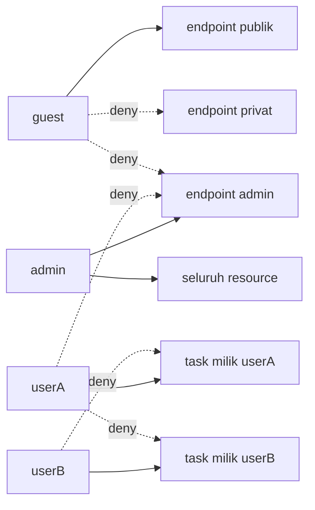
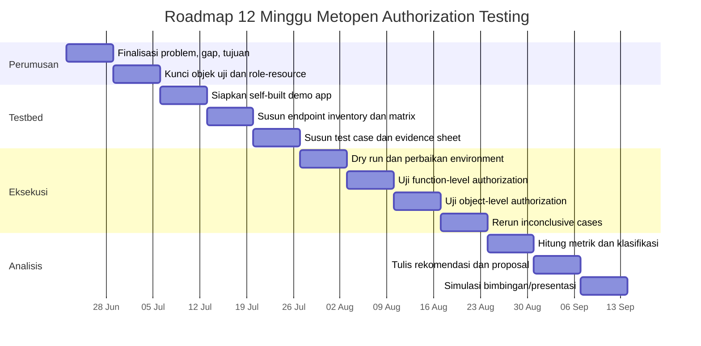

# Evaluasi Kontrol Otorisasi Level Fungsi dan Level Objek pada Aplikasi Web Multi-Role Menggunakan OWASP Web Security Testing Guide

## Ringkasan Eksekutif

README ini dirancang sebagai dokumen kerja Metodologi Penelitian yang sekaligus cukup rapi untuk dijadikan dasar proposal S1. Titik tolaknya adalah masalah penelitian yang jelas: **keberadaan login, session, dan role pada aplikasi web tidak otomatis menjamin bahwa kontrol otorisasi benar-benar ditegakkan secara konsisten di sisi server untuk setiap endpoint, method, dan resource**. OWASP menempatkan **Broken Access Control** sebagai **A01:2025** dan menjelaskan bahwa kegagalan kontrol akses biasanya berujung pada pengungkapan informasi tanpa izin, modifikasi atau penghapusan data, serta eksekusi fungsi bisnis di luar batas pengguna. Pada halaman resmi A01:2025, OWASP juga menyebut contoh yang sangat relevan untuk penelitian ini: parameter tampering atau force browsing, IDOR, akses POST/PUT/DELETE tanpa kontrol yang memadai, privilege escalation, dan manipulasi metadata seperti JWT atau cookie. citeturn2view0

Metode yang dipilih mengacu pada **OWASP Web Security Testing Guide v4.2** karena versi ini dinyatakan sebagai **stable version** dan secara spesifik sudah menyediakan area **Authorization Testing**, termasuk **WSTG-ATHZ-02 Testing for Bypassing Authorization Schema**, **WSTG-ATHZ-03 Testing for Privilege Escalation**, dan **WSTG-ATHZ-04 Testing for Insecure Direct Object References**. Dengan begitu, penelitian ini bukan “pentest umum” dan bukan “bikin aplikasi”, melainkan **studi kasus evaluatif** yang membandingkan **expected access** terhadap **actual access** berdasarkan matriks hak akses yang dibekukan di awal. citeturn2view1turn6view0turn7view1turn7view5

Struktur README ini juga sengaja mengikuti pelajaran metodologi penelitian yang kamu kumpulkan dari transkrip video dan review teman: penelitian harus berangkat dari **masalah penelitian**, harus memberi **kontribusi pengetahuan** meskipun kecil, dan dalam penelitian Informatika **software bukan tujuan utama melainkan testbed** untuk menguji ide atau metode. Karena itu, aplikasi web yang dipakai di sini diposisikan sebagai **objek uji**, bukan hasil utama penelitian. Masukan peer yang paling penting juga diakomodasi penuh: objek penelitian dikunci ke **satu aplikasi web multi-role**, scope dibatasi hanya pada **authorization**, metrik didefinisikan di awal, etika dinyatakan tegas, dan reproducibility dijadikan bagian inti desain. fileciteturn0file2 fileciteturn0file0 fileciteturn0file1

Secara praktis, README ini menghasilkan satu kerangka kerja yang dapat dijalankan: tujuan penelitian, pertanyaan penelitian, definisi operasional, unit analisis, hipotesis kerja yang hati-hati, kriteria pemilihan testbed, rancangan deployment berbasis Docker, matriks hak akses, lebih dari 20 test case konkret, template evidence, metrik evaluasi, rencana analisis data, checklist reproducibility, risiko dan mitigasi, deliverables, roadmap 12 minggu, pertanyaan penguji yang mungkin muncul, dan lampiran template yang siap dipakai. Referensi yang diprioritaskan adalah sumber primer dan resmi: **OWASP Top 10:2025**, **OWASP WSTG v4.2**, **OWASP Authorization Cheat Sheet**, **OWASP ASVS 5.0.0**, **NIST RBAC**, **NIST SP 800-162 ABAC**, serta literatur pendukung **OpenSSF** dan **SLSA** untuk memperkuat disiplin dokumentasi, integritas artefak, dan reproducibility. citeturn2view0turn2view1turn2view2turn5view0turn8view0turn9view2turn10view0turn10view1

## Rasional Penelitian dan Kesesuaian Metopen

Masalah penelitian ini dapat dirumuskan sebagai berikut: **penerapan kontrol akses pada aplikasi web pembelajaran atau aplikasi web sederhana sering cukup sampai pada level UI, menu, atau pembagian role, tetapi belum tentu dibuktikan bahwa validasi server-side benar-benar mencegah akses yang tidak semestinya pada level fungsi maupun level objek**. Rumusan ini selaras dengan OWASP Top 10:2025 A01, yang mendefinisikan access control sebagai mekanisme yang menegakkan kebijakan agar pengguna tidak dapat bertindak di luar izin yang ditetapkan. OWASP menekankan bahwa cacat umum di area ini mencakup akses ke akun orang lain melalui identifier, akses ke endpoint POST/PUT/DELETE tanpa kontrol memadai, privilege escalation, force browsing, dan kontrol akses yang hanya ditempatkan di front end. citeturn2view0

**Gap penelitian** pada konteks ini bukan “belum ada yang meneliti Broken Access Control”, karena itu jelas tidak benar. Gap yang diambil lebih rendah, lebih aman, dan lebih relevan untuk S1: **pada banyak aplikasi web pembelajaran dan proyek sederhana, evaluasi otorisasi sering tidak dinyatakan sebagai matriks hak akses dan tidak diuji secara sistematis dengan expected-vs-actual berbasis skenario OWASP WSTG**. Dengan kata lain, terdapat jarak antara “aplikasi punya role” dan “aplikasi benar-benar aman pada setiap request”. WSTG-ATHZ-02 sendiri memang menyuruh penguji memverifikasi apakah resource masih bisa diakses oleh pengguna yang tidak terautentikasi, setelah logout, oleh role berbeda, dan oleh identitas lain dengan role yang sama; WSTG-ATHZ-04 menambahkan bahwa object reference harus diuji dengan memodifikasi parameter dan membandingkan akses antar-pengguna. citeturn6view0turn7view5

Kesesuaian dengan prinsip Metopen dari transkrip video dan review teman dapat dilihat pada tabel berikut.

| Kriteria dari transkrip/peer review | Implementasi dalam README ini |
|---|---|
| Penelitian harus berangkat dari masalah penelitian, bukan sekadar minat | Bab ini memformulasikan problem penelitian pada mismatch antara role/UI dan server-side authorization. |
| Software bukan tujuan utama penelitian | Self-built app diposisikan sebagai **testbed**; kontribusi utamanya adalah evaluasi, bukan aplikasi. |
| Harus ada kontribusi pengetahuan | Kontribusi dibatasi secara proporsional: matriks hak akses, test case, evidence, metrik, dan rekomendasi evaluatif. |
| Scope harus ketat | Hanya authorization; tidak mencakup SQLi, XSS, CSRF, malware, brute force, social engineering, atau pentest umum. |
| Objek penelitian harus dikunci | Dipilih satu aplikasi web multi-role sebagai objek utama. |
| Metode harus terukur dan dapat diulang | Menggunakan unit analisis eksplisit, test case, evidence file, dan rumus metrik. |
| Etika harus eksplisit | Pengujian hanya di lingkungan lokal/lab atau sistem yang memiliki izin. |

Pendekatan ini sejalan dengan isi transkrip metodologi yang menegaskan bahwa penelitian Informatika tidak boleh berhenti pada “bikin software”, tetapi harus memberi kontribusi pengetahuan dan memanfaatkan software sebagai sarana evaluasi. Review teman juga menegaskan bahwa objek uji harus dikunci, scope harus dijaga agar tidak melebar ke seluruh OWASP, dan status vulnerable harus didefinisikan secara biner berdasarkan matriks hak akses. fileciteturn0file2 fileciteturn0file0 fileciteturn0file1

**Tujuan penelitian** yang paling tepat adalah lima hal. Pertama, menyusun matriks hak akses pada satu aplikasi web multi-role. Kedua, menerjemahkan WSTG Authorization Testing ke dalam test case level fungsi dan level objek. Ketiga, membandingkan hasil aktual terhadap hasil yang diharapkan untuk setiap kombinasi identitas, role, endpoint, method, dan ownership. Keempat, mengidentifikasi ketidaksesuaian yang dapat diklasifikasikan sebagai vulnerable, compliant, logic error, atau inconclusive. Kelima, menyusun rekomendasi perbaikan yang mengikuti prinsip **deny by default**, **validate on every request**, dan **record ownership enforcement** sebagaimana dianjurkan OWASP. citeturn3view1turn3view2turn2view0

**Pertanyaan penelitian** dirumuskan secara sempit dan terukur sebagai berikut.  
Apakah kontrol otorisasi level fungsi pada aplikasi web multi-role telah mencegah akses vertikal yang tidak semestinya.  
Apakah kontrol otorisasi level objek pada aplikasi web multi-role telah mencegah akses horizontal atau ownership bypass terhadap resource milik pengguna lain.  
Bagaimana menyusun test case authorization yang replikatif dengan mengacu pada WSTG-ATHZ-02, WSTG-ATHZ-03, dan WSTG-ATHZ-04.  
Bagaimana tingkat kesesuaian expected access dan actual access jika diukur melalui metrik penelitian ini.  
Apa rekomendasi mitigasi yang paling relevan terhadap temuan yang muncul. citeturn6view0turn7view1turn7view5

Untuk menjaga ketelitian konseptual, judul ini **sengaja tidak dikunci hanya pada RBAC**. OWASP Authorization Cheat Sheet menyatakan bahwa dalam rekayasa perangkat lunak, selain RBAC ada **ABAC** dan **ReBAC**, dan untuk aplikasi modern pendekatan berbasis atribut atau relasi sering lebih tepat dibanding RBAC murni. Ini penting karena penelitian ini jelas menguji bukan hanya “admin vs user”, tetapi juga “user A vs resource milik user B”, yang berada pada ranah object-level authorization dan ownership. Dari sisi teori dasar, NIST RBAC tetap dipakai untuk fondasi konseptual role-permission, tetapi NIST SP 800-162 dipakai untuk mengingatkan bahwa keputusan authorization dapat bergantung pada atribut subjek, objek, operasi, dan lingkungan. citeturn3view0turn8view0turn9view2

## Rumusan Penelitian dan Definisi Operasional

**Definisi operasional Broken Access Control** dalam penelitian ini adalah: *setiap kondisi ketika hasil aktual permintaan terhadap endpoint, fungsi, atau objek tidak sesuai dengan hak akses yang telah didefinisikan pada matriks otorisasi, sehingga pengguna dapat mengakses, memodifikasi, menghapus, atau menjalankan fungsi di luar batas yang seharusnya berlaku baginya*. Definisi ini mengikuti deskripsi OWASP A01:2025 tentang akses di luar intended permissions dan juga mengikuti WSTG authorization testing yang memeriksa kemungkinan akses horizontal, vertikal, dan direct object reference. citeturn2view0turn6view0turn7view5

**Definisi operasional function-level authorization** dalam penelitian ini adalah kontrol yang menentukan apakah identitas atau role tertentu boleh atau tidak boleh menjalankan fungsi atau endpoint tertentu, misalnya `/admin/users`, `/admin/dashboard`, atau `/reports/export`. Kegagalan pada level ini umumnya muncul sebagai **vertical privilege escalation**, force browsing ke halaman admin, atau pemanggilan endpoint admin oleh role yang lebih rendah. WSTG-ATHZ-02 menyatakan bahwa pengujian perlu memeriksa apakah resource dapat diakses oleh pengguna dengan role berbeda, sesudah logout, atau bahkan tanpa autentikasi. WSTG-ATHZ-03 menjelaskan bahwa vertical privilege escalation terjadi ketika pengguna mengakses resource yang seharusnya hanya untuk akun dengan hak lebih tinggi. citeturn6view0turn7view2

**Definisi operasional object-level authorization** dalam penelitian ini adalah kontrol yang menentukan apakah identitas tertentu boleh atau tidak boleh mengakses objek tertentu berdasarkan kepemilikan atau relasi, misalnya task, profil, order, invoice, atau file. Di sini fokusnya adalah apakah `userA` bisa melihat atau memodifikasi objek milik `userB`. WSTG-ATHZ-04 mendefinisikan IDOR sebagai situasi ketika aplikasi memberikan akses langsung ke objek berdasarkan input pengguna dan gagal melakukan authorization checks yang cukup. WSTG juga menyarankan pengujian dengan minimum dua pengguna untuk menghemat waktu dan memastikan coverage terhadap owned objects yang berbeda. citeturn7view5turn7view4

**Definisi operasional vulnerable** pada penelitian ini ditetapkan secara eksplisit agar tidak ambigu. Sebuah test case diberi status **Vulnerable** apabila salah satu dari empat kondisi berikut terjadi: hasil yang diharapkan adalah **deny**, tetapi hasil aktual adalah **allow**; response body memuat data privat pengguna lain; state perubahan pada resource pengguna lain berhasil terjadi; atau fungsi yang seharusnya khusus untuk role lebih tinggi dapat dijalankan oleh role yang lebih rendah. Kriteria ini mengadaptasi bahan WSTG-ATHZ-02, yang menyatakan bahwa aplikasi dianggap rentan bila response sama, memuat private data yang sama, atau menunjukkan operasi yang berhasil terhadap resource pengguna lain, serta bagian vertical bypass yang menyatakan rentan bila fungsi privilege lebih tinggi berhasil dijalankan oleh session yang lebih lemah. citeturn6view0

**Unit analisis** pada penelitian ini adalah satuan kombinasi berikut:

```text
identitas × role × endpoint × HTTP method × aksi × konteks ownership
```

Contoh unit analisis yang paling khas adalah:

```text
userA × user × GET /tasks/200 × read × owner=userB
```

Expected result untuk unit ini adalah **deny**, sedangkan actual result akan diambil dari response aplikasi. Struktur ini dipilih karena paling sesuai dengan kenyataan bahwa masalah authorization tidak terjadi hanya pada role, tetapi juga pada relationship terhadap resource. Ia juga langsung bisa diturunkan ke test case, evidence, dan perhitungan metrik. citeturn6view0turn7view5

**Hipotesis kerja** pada penelitian ini dibuat hati-hati agar tidak overclaim.  
H0: seluruh actual access sesuai dengan matriks hak akses yang telah didefinisikan.  
H1-F: terdapat setidaknya satu ketidaksesuaian pada function-level authorization, terutama bila validasi otorisasi hanya diletakkan di UI atau middleware belum diterapkan secara konsisten.  
H1-O: terdapat setidaknya satu ketidaksesuaian pada object-level authorization, terutama bila pemeriksaan ownership record tidak dilakukan di sisi server.  
Namun, penelitian ini tetap dianggap berhasil walaupun H1-F dan H1-O tidak terbukti, karena luaran utamanya adalah **evaluasi kesesuaian otorisasi**. Kalau tidak ditemukan mismatch, hasilnya tetap bernilai sebagai laporan kepatuhan otorisasi terhadap matriks yang ditetapkan. Argumen “hasil nol pun tetap valid” sejalan dengan semangat transkrip metode penelitian yang menekankan proses terukur dan jujur, serta review peer yang menegaskan bahwa tidak ditemukannya celah harus tetap diinterpretasikan sebagai compliance report, bukan kegagalan penelitian. fileciteturn0file2 fileciteturn0file0

**Ruang lingkup** dibatasi sangat tegas. Objek penelitian hanya **satu aplikasi web multi-role**. Pengujian hanya mencakup authorization level fungsi dan level objek. Teknik yang dipakai hanya terbatas pada observasi request-response, modifikasi parameter, switching identity/session, dan forced browsing yang sesuai dengan WSTG authorization testing. Tidak ada pengujian SQL injection, XSS, CSRF, insecure deserialization, malware, brute force, phising, social engineering, lateral movement infrastruktur, privilege escalation sistem operasi, atau penyerangan sistem publik. Batas ini penting agar penelitian tetap konsisten, dapat selesai dalam 12 minggu, dan tidak bergeser menjadi pentest umum. citeturn2view1turn6view0turn7view5

**Pernyataan etika** untuk penelitian ini bersifat non-negosiasi. Seluruh aktivitas pengujian hanya dilakukan pada lingkungan yang dikendalikan peneliti, yaitu aplikasi lokal/lab atau sistem yang memiliki izin tertulis. OWASP WebGoat menyatakan secara eksplisit bahwa seluruh pembelajaran seperti ini harus terjadi pada **safe and legal environment**, serta menegaskan bahwa kita tidak seharusnya mencoba mencari celah tanpa izin. WebGoat juga memperingatkan agar mesin yang menjalankan program berada dalam kondisi aman, bahkan menyarankan memutus Internet saat menggunakan program, karena aplikasi dibuat secara sengaja tidak aman. Oleh karena itu, dokumen ini mengharuskan penggunaan **data dummy**, tidak melibatkan data pribadi riil, dan tidak mempublikasikan bukti teknis sensitif tanpa izin pemilik aplikasi. citeturn12view0turn12view2

## Desain Metodologi dan Testbed

Jenis penelitian yang dipilih adalah **studi kasus evaluatif dengan pengujian teknis empiris**. Pilihan ini paling sesuai dengan pertanyaan penelitian karena yang diobservasi bukan persepsi pengguna dan bukan efek kausal antarkelompok manusia, melainkan **perilaku sistem** ketika diberi request tertentu dari identitas dan role tertentu. OWASP WSTG secara tegas memosisikan authorization testing sebagai aktivitas pengujian atas implementasi skema otorisasi terhadap fungsi dan resource. OWASP ASVS juga menyatakan bahwa ASVS menyediakan basis untuk pengujian kontrol keamanan teknis aplikasi web, sehingga cocok menjadi acuan bahasa requirement dan pelabelan kontrol, walaupun metode uji detail tetap bertumpu pada WSTG. citeturn2view1turn6view0turn5view0

**Kriteria pemilihan testbed** ditetapkan agar objek uji tidak lagi kabur. Testbed harus memenuhi lima syarat. Pertama, memiliki minimal tiga role yang berbeda, misalnya `guest`, `user`, dan `admin`. Kedua, memiliki minimal satu resource yang jelas ownership-nya, misalnya `task.owner_id = user.id`. Ketiga, memiliki endpoint level fungsi yang memang berbeda antar-role, seperti endpoint admin. Keempat, dapat dideploy lokal dengan mudah agar legal dan reproducible. Kelima, endpoint dan data seed dapat dibekukan sejak awal untuk memudahkan matriks hak akses. Kriteria ini langsung menjawab kritik peer bahwa objek penelitian harus segera dikunci dan tidak boleh sekadar “aplikasi web berbasis RBAC” yang terlalu abstrak. fileciteturn0file0 fileciteturn0file1

**Rekomendasi testbed utama** adalah **self-built demo app** yang sengaja sederhana, misalnya `demo-auth-app` atau `TaskHub`, karena pilihan ini paling memudahkan penyelarasan antara judul, scope, matriks hak akses, dan test case. Namun, aplikasi ini **harus diposisikan sebagai testbed** dan bukan output utama penelitian. Transkrip metodologi yang kamu kumpulkan menegaskan bahwa dalam penelitian Informatika, software hanyalah sarana untuk mengimplementasikan dan mengevaluasi mekanisme; karena itu README ini secara eksplisit menyebut bahwa kontribusi penelitian bukan aplikasi, melainkan evaluasi authorization-nya. fileciteturn0file2

**Testbed cadangan** yang direkomendasikan adalah **OWASP Juice Shop** dan **OWASP WebGoat**. Juice Shop berguna sebagai backup dan sebagai wahana dry run karena proyek resmi OWASP menyebutnya sebagai aplikasi web tidak aman yang modern, dapat dipakai untuk training, awareness demo, CTF, dan sebagai “guinea pig” bagi security tools. Proyek ini juga secara resmi menyatakan bahwa instalasi mudah dilakukan melalui Node.js, Docker, atau Vagrant. WebGoat cocok sebagai cadangan edukatif karena merupakan aplikasi yang secara sengaja dibuat tidak aman untuk mempelajari kerentanan aplikasi web pada lingkungan legal. Namun, dua testbed ini **tidak direkomendasikan sebagai objek utama** untuk proposal jika tujuan utamanya adalah matriks role-owner-endpoint yang bersih dan sempit, karena keduanya membawa ruang latihan yang jauh lebih luas daripada yang dibutuhkan penelitian ini. Rekomendasi “self-built utama, Juice Shop/WebGoat cadangan” juga mengikuti masukan peer yang meminta satu objek yang jelas dan scope yang ketat. citeturn11view0turn12view0turn12view2 fileciteturn0file0

**Docker direkomendasikan** sebagai strategi deployment karena Docker mendefinisikan container sebagai proses terisolasi untuk setiap komponen aplikasi, dengan sifat self-contained, isolated, independent, dan portable. Karakteristik ini ideal untuk penelitian karena memudahkan replikasi environment yang sama di laptop peneliti, laptop pembimbing, atau laboratorium. Docker juga menunjukkan bahwa untuk proyek web yang lebih kompleks, frontend, backend, dan database dapat dijalankan pada container yang berbeda. Rekomendasi ini sangat cocok untuk kebutuhan penelitian yang ingin menjaga lingkungan uji tetap stabil dan dapat diulang. citeturn12view3

Ringkasan arsitektur testbed yang direkomendasikan adalah sebagai berikut.



**Ringkasan deployment yang direkomendasikan** untuk testbed utama adalah sebagai berikut. Komponen minimal terdiri dari `app` dan `db`. Database boleh menggunakan PostgreSQL atau MySQL; contoh paling praktis adalah PostgreSQL. Environment minimal memerlukan satu file `docker-compose.yml`, satu file `.env`, satu skrip `seed.sql` atau `seed.js`, dan satu direktori `evidence/` untuk menyimpan request-response. Startup dilakukan dengan `docker compose up -d --build`, lalu seed account dijalankan. Karena ini README penelitian, perintah di bawah ditulis sebagai template implementasi, bukan sebagai sumber kontribusi penelitian.

```yaml
version: "3.9"
services:
  app:
    build: .
    container_name: demo-auth-app
    ports:
      - "8080:8080"
    env_file:
      - .env
    depends_on:
      - db
    volumes:
      - ./evidence:/app/evidence
  db:
    image: postgres:16
    container_name: demo-auth-db
    environment:
      POSTGRES_DB: authdemo
      POSTGRES_USER: authdemo
      POSTGRES_PASSWORD: authdemo
    ports:
      - "5432:5432"
    volumes:
      - db_data:/var/lib/postgresql/data
volumes:
  db_data:
```

**Setup identitas dan akun** minimal harus dibekukan di awal eksperimen. Gunakan `guest`, `userA`, `userB`, dan `admin`. Masing-masing akun harus memiliki password dummy dan sumber daya yang sudah terseed. Minimal terdapat dua task milik `userA` dan dua task milik `userB`, satu profil per pengguna, satu atau dua file yang terasosiasi dengan masing-masing user, serta satu atau dua fungsi admin-only seperti `report export` dan `user management`. WSTG-ATHZ-04 menegaskan manfaat memiliki setidaknya dua pengguna dengan owned objects yang berbeda. citeturn7view4turn7view5

**Matriks hak akses awal** berikut menjadi dasar seluruh evaluasi. Matriks ini harus dibekukan sebelum pengumpulan data, agar tidak terjadi bias “mengubah aturan setelah melihat hasil”.

| Endpoint/Fungsi | guest | user (akun sendiri) | user (akun orang lain) | admin |
|---|---|---|---|---|
| `GET /login` | allow | allow | allow | allow |
| `POST /login` | allow | allow | allow | allow |
| `GET /dashboard` | deny | allow | n/a | allow |
| `GET /admin/dashboard` | deny | deny | deny | allow |
| `GET /admin/users` | deny | deny | deny | allow |
| `POST /admin/users` | deny | deny | deny | allow |
| `GET /tasks` | deny | allow own list | deny others by filter | allow |
| `GET /tasks/{id}` | deny | allow own object | deny | allow |
| `PUT /tasks/{id}` | deny | allow own object | deny | allow |
| `DELETE /tasks/{id}` | deny | deny atau allow-own-only sesuai desain | deny | allow |
| `GET /profile/{id}` | deny | allow own profile | deny | allow |
| `PUT /profile/{id}` | deny | allow own profile | deny | allow |
| `GET /reports/export` | deny | deny | deny | allow |
| `GET /files/{filename}` | deny | allow own file | deny | allow |

**Prosedur eksperimen** dilakukan dalam delapan langkah.  
Pertama, bekukan requirement role, endpoint, dan ownership pada testbed.  
Kedua, deploy testbed di Docker dan jalankan seed account.  
Ketiga, buat matriks hak akses final yang disetujui pembimbing.  
Keempat, susun test case berdasarkan WSTG-ATHZ-02, ATHZ-03, dan ATHZ-04.  
Kelima, buat session atau token terpisah untuk `userA`, `userB`, dan `admin`.  
Keenam, jalankan request sesuai test case, rekam request dan response mentah, screenshot, dan timestamp.  
Ketujuh, bandingkan actual access terhadap matriks, lalu klasifikasikan status.  
Kedelapan, hitung metrik kesesuaian dan failure rate, kemudian analisis pola temuan dan rekomendasi mitigasinya.  
Seluruh alur ini secara substansial mengikuti prinsip WSTG bahwa pengujian harus memeriksa horizontal access, vertical access, logout access, dan object reference tampering. citeturn6view0turn7view1turn7view5

## Instrumen Pengujian, Data, dan Analisis

Instrumen penelitian terdiri dari empat artefak inti: **matriks hak akses**, **daftar endpoint terpilih**, **lembar test case**, dan **lembar evidence**. Alat bantu yang boleh dipakai adalah browser developer tools, `curl`, Postman, Burp Suite, atau OWASP ZAP. Namun, mengikuti prinsip Metopen dan review peer, README ini menegaskan bahwa **tool bukan pusat penelitian**. Data penelitian tetaplah expected access, actual response, dan interpretasi terhadap rule authorization. ZAP sendiri diposisikan secara resmi sebagai web app scanner yang gratis dan open source, sehingga cocok bila ingin dipakai sebagai alat bantu rekam atau replay request. citeturn13view0 fileciteturn0file2

Tabel berikut berisi **24 test case konkret** yang dapat dipakai langsung. Seluruhnya adalah adaptasi operasional dari WSTG-ATHZ-02, WSTG-ATHZ-03, dan WSTG-ATHZ-04 ke testbed multi-role yang sempit. Status awal diisi `Planned`, lalu diubah saat eksekusi.

| ID | Category | Actor | Endpoint | Method | Resource Owner | Expected | Reproduction Steps | Evidence File | Status |
|---|---|---|---|---|---|---|---|---|---|
| TC-01 | Function-level / unauthenticated | guest | `/dashboard` | GET | n/a | deny | Buka endpoint tanpa login | `TC-01.*` | Planned |
| TC-02 | Function-level / unauthenticated | guest | `/admin/dashboard` | GET | n/a | deny | Ketik URL admin langsung tanpa login | `TC-02.*` | Planned |
| TC-03 | Function-level / vertical | userA | `/admin/dashboard` | GET | n/a | deny | Login sebagai userA lalu buka URL admin | `TC-03.*` | Planned |
| TC-04 | Function-level / vertical | userA | `/admin/users` | GET | n/a | deny | Login userA lalu akses daftar user admin | `TC-04.*` | Planned |
| TC-05 | Function-level / vertical | userA | `/admin/users` | POST | n/a | deny | Kirim request create user sebagai userA | `TC-05.*` | Planned |
| TC-06 | Object-level / horizontal | userA | `/tasks/200` | GET | userB | deny | Login userA, ganti ID task ke milik userB | `TC-06.*` | Planned |
| TC-07 | Object-level / horizontal | userA | `/tasks/200` | PUT | userB | deny | Login userA, kirim update ke task milik userB | `TC-07.*` | Planned |
| TC-08 | Object-level / horizontal | userA | `/tasks/200` | DELETE | userB | deny | Login userA, hapus task milik userB | `TC-08.*` | Planned |
| TC-09 | Object-level / horizontal | userA | `/profile/2` | GET | userB | deny | Login userA, ubah ID profile ke milik userB | `TC-09.*` | Planned |
| TC-10 | Object-level / horizontal | userA | `/profile/2` | PUT | userB | deny | Login userA, coba edit profil userB | `TC-10.*` | Planned |
| TC-11 | Object-level / horizontal | userB | `/tasks/100` | GET | userA | deny | Login userB, akses task milik userA | `TC-11.*` | Planned |
| TC-12 | Object-level / horizontal | userB | `/tasks/100` | PUT | userA | deny | Login userB, ubah task milik userA | `TC-12.*` | Planned |
| TC-13 | Function-level / vertical | userA | `/reports/export` | GET | n/a | deny | Login userA, akses export report | `TC-13.*` | Planned |
| TC-14 | Function-level / vertical | userA | `/reports/export` | POST | n/a | deny | Trigger export report via POST sebagai userA | `TC-14.*` | Planned |
| TC-15 | Function-level / forced browsing | userA | `/admin/logs` | GET | n/a | deny | Masukkan URL admin logs secara manual | `TC-15.*` | Planned |
| TC-16 | Object-level / query tampering | userA | `/tasks?owner=2` | GET | userB | deny atau self-filter | Login userA, ubah query owner | `TC-16.*` | Planned |
| TC-17 | Object-level / file access | userA | `/files/invoice-userB.pdf` | GET | userB | deny | Login userA, akses file userB | `TC-17.*` | Planned |
| TC-18 | Session / logout | userA logout | `/tasks/100` | GET | userA | deny | Login userA, logout, ulang akses endpoint | `TC-18.*` | Planned |
| TC-19 | Function-level / positive control | admin | `/admin/users` | GET | n/a | allow | Login admin lalu akses daftar user | `TC-19.*` | Planned |
| TC-20 | Function-level / positive control | admin | `/admin/users` | POST | n/a | allow | Login admin lalu buat user baru | `TC-20.*` | Planned |
| TC-21 | Object-level / positive control | userA | `/tasks/100` | GET | userA | allow | Login userA lalu akses task sendiri | `TC-21.*` | Planned |
| TC-22 | Object-level / positive control | userA | `/tasks/100` | PUT | userA | allow | Login userA lalu ubah task sendiri | `TC-22.*` | Planned |
| TC-23 | Object-level / positive control | admin | `/tasks/200` | DELETE | userB | allow | Login admin lalu hapus task userB | `TC-23.*` | Planned |
| TC-24 | Function-level / GUI bypass check | userA | `/admin/addUser` | POST | n/a | deny | Gunakan endpoint langsung walau tombol admin tidak muncul | `TC-24.*` | Planned |

**Template evidence** wajib cukup rinci sehingga penguji dapat mengikuti dan mengulang langkah uji. Minimum evidence untuk setiap test case terdiri dari request mentah, response mentah, potongan response body, timestamp, dan satu screenshot bila relevan. Format yang direkomendasikan adalah seperti berikut.

```bash
# file: evidence/TC-06_request.txt
curl -i \
  -X GET "http://localhost:8080/tasks/200" \
  -H "Cookie: session=userA-session-cookie" \
  -H "Accept: application/json"
```

```http
# file: evidence/TC-06_response.txt
HTTP/1.1 403 Forbidden
Content-Type: application/json
Date: 2026-06-25T09:15:42+07:00

{"error":"forbidden","message":"you are not allowed to access this resource"}
```

```json
{
  "test_case_id": "TC-06",
  "timestamp": "2026-06-25T09:15:42+07:00",
  "actor": "userA",
  "role": "user",
  "endpoint": "/tasks/200",
  "method": "GET",
  "resource_owner": "userB",
  "expected": "deny",
  "actual_status_code": 403,
  "actual_verdict": "deny",
  "evidence_files": [
    "TC-06_request.txt",
    "TC-06_response.txt",
    "TC-06_screenshot.png"
  ],
  "analyst_note": "Compliant; ownership check enforced server-side."
}
```

**Metrik penelitian** berikut adalah operasionalisasi yang dibuat khusus untuk studi ini. Mereka bukan rumus resmi OWASP, tetapi dibangun secara langsung dari logika WSTG yang membandingkan expected access dan actual access.

```text
Authorization Compliance Rate (ACR)
= (jumlah test case dengan actual sesuai expected / total test case dieksekusi) × 100%
```

```text
Access Control Failure Rate (ACFR)
= (jumlah test case expected=deny tetapi actual=allow / total test case expected=deny) × 100%
```

```text
Function-Level Failure Rate (FLFR)
= (jumlah temuan vulnerable pada kategori function-level / total test case function-level) × 100%
```

```text
Object-Level Failure Rate (OLFR)
= (jumlah temuan vulnerable pada kategori object-level / total test case object-level) × 100%
```

```text
Evidence Completeness Rate (ECR)
= (jumlah test case dengan request, response, timestamp, dan note lengkap / total test case dieksekusi) × 100%
```

Empat status interpretasi yang dipakai adalah: **Compliant**, **Vulnerable**, **Logic Error**, dan **Inconclusive**. `Logic Error` dipakai ketika expected adalah `allow` tetapi actual justru `deny`, atau ketika respons menunjukkan perilaku salah konfigurasi yang tidak termasuk bypass keamanan. `Inconclusive` dipakai jika environment bermasalah, session rusak, atau data precondition belum tersedia. Status ini penting agar analisis tidak memaksa semua kasus menjadi “aman” atau “rentan”. Prinsip ini konsisten dengan semangat transkrip metodologi: jawaban harus jujur, terukur, dan tidak memanipulasi hasil. fileciteturn0file2

**Rencana pengumpulan data** dilakukan per test case. Setiap baris test case menghasilkan satu bundle evidence. Bundle itu berisi identitas penguji, role, endpoint, method, parameter/body, ownership target, expected, actual status, actual body ringkas, status klasifikasi, dan file bukti. Setelah semua bundle terkumpul, dilakukan agregasi metrik per kategori. Analisis tidak berhenti pada menghitung rate, tetapi juga membaca pola temuan. Misalnya, bila seluruh function-level test gagal tetapi object-level test lolos, berarti masalah ada pada middleware endpoint admin. Bila object-level test gagal tetapi function-level test lolos, berarti role check ada tetapi record ownership check tidak ada. Logika analisis pola seperti ini sangat membantu pada pembahasan Bab 4.

**Rencana analisis** dapat dibagi menjadi tiga lapis. Lapis pertama adalah **deskriptif**, yaitu jumlah test case dieksekusi, jumlah comply, jumlah vulnerable, jumlah error, jumlah inconclusive. Lapis kedua adalah **komparatif internal**, yaitu perbandingan function-level vs object-level dan perbandingan antar-aktor `guest`, `userA`, `userB`, `admin`. Lapis ketiga adalah **diagnostik**, yaitu menghubungkan temuan dengan prinsip OWASP seperti deny by default, validate every request, dan record ownership. OWASP A01:2025 sendiri menekankan bahwa model access control seharusnya menegakkan record ownership dan ditulis di trusted server-side code atau serverless APIs; Authorization Cheat Sheet juga secara eksplisit menyarankan validasi di setiap request dan deny by default. citeturn2view0turn3view1turn3view2

## Roadmap, Deliverables, dan Reproducibility

Deliverables penelitian ini harus dibuat konkret sejak awal agar tidak berubah menjadi “nanti lihat hasilnya apa”. Luaran minimal yang harus ada pada akhir Metopen adalah: **README kerja ini**, **proposal ringkas 2–4 halaman**, **matriks hak akses final**, **daftar endpoint uji**, **24 test case planned**, **evidence template**, **hasil eksekusi test case**, **tabel metrik**, **analisis temuan**, dan **rekomendasi mitigasi**. Bila waktu cukup, sebuah lampiran teknis berisi tangkapan request-response dan file seed data juga boleh disiapkan. Deliverables ini secara langsung menjawab masukan peer bahwa pembimbing akan lebih mudah menerima penelitian bila output-nya bukan “tool”, melainkan paket evaluasi yang rapi dan bisa dibaca. fileciteturn0file0 fileciteturn0file1

**Checklist reproducibility** berikut wajib dipenuhi.  
Pertama, versi referensi resmi harus ditulis eksplisit, terutama **OWASP WSTG v4.2** dan **OWASP ASVS 5.0.0**. Pada ASVS, OWASP bahkan menyarankan penulisan requirement dengan penanda versi seperti `v5.0.0-<id>` agar tidak ambigu ketika versi standar berubah. Kedua, environment deployment harus dideskripsikan: OS, Docker version, database image, port mapping, dan commit hash testbed. Ketiga, akun seed dan data dummy harus dibekukan. Keempat, setiap test case harus punya precondition. Kelima, file evidence harus ditata dengan naming convention yang konsisten. Keenam, timestamp harus menggunakan zona waktu yang jelas. Ketujuh, hasil analisis harus bisa direkonstruksi dari raw evidence. citeturn5view0turn3view7

Contoh struktur direktori yang direkomendasikan:

```text
metopen-authz/
├── README.md
├── proposal-ringkas/
│   └── proposal-2-4-halaman.md
├── testbed/
│   ├── docker-compose.yml
│   ├── .env.example
│   └── seed/
├── matrices/
│   └── access-matrix.csv
├── testcases/
│   ├── testcases.csv
│   └── testcases-filled/
├── evidence/
│   ├── TC-01_request.txt
│   ├── TC-01_response.txt
│   ├── TC-01_screenshot.png
│   └── ...
├── analysis/
│   ├── metrics.xlsx
│   └── findings.md
└── appendices/
    ├── evidence-schema.json
    └── sample-filled-testcase.md
```

**Risiko dan keterbatasan** harus diakui sejak awal. Risiko pertama adalah penelitian dianggap sebagai project pembuatan aplikasi. Mitigasinya adalah menulis dengan tegas bahwa aplikasi hanyalah testbed. Risiko kedua adalah scope melebar ke semua OWASP Top 10. Mitigasinya adalah tetap hanya menguji WSTG authorization. Risiko ketiga adalah tidak ditemukannya celah. Mitigasinya adalah menafsirkan hasil sebagai compliance report. Risiko keempat adalah bias karena aplikasi dibuat sendiri. Mitigasinya adalah membekukan requirement, matriks, dan dataset sebelum eksekusi serta menyimpan evidence mentah. Risiko kelima adalah gangguan lingkungan uji container. Mitigasinya adalah penggunaan Docker, seed script, serta pencatatan versi environment. Docker menekankan bahwa container bersifat isolated, self-contained, dan portable, sehingga cocok untuk mengurangi variasi environment. citeturn12view3

**Sumber literatur yang diprioritaskan** disusun berlapis. Lapisan inti untuk teori dan metode terdiri dari OWASP Top 10:2025 A01, OWASP WSTG v4.2, OWASP Authorization Cheat Sheet, OWASP ASVS 5.0.0, NIST RBAC, dan NIST SP 800-162. Lapisan pendukung untuk praktik deployment, local lab, dan kualitas rantai pasok dokumentasi terdiri dari Docker Docs, Juice Shop, WebGoat, OpenSSF Software Supply Chain, dan SLSA. OpenSSF menjelaskan bahwa tujuan working group supply chain adalah membantu individu dan organisasi menilai serta meningkatkan keamanan end-to-end supply chain open source, sedangkan SLSA memosisikan dirinya sebagai framework dan checklist untuk mencegah tampering, meningkatkan integrity, dan mengamankan package serta infrastruktur. Di konteks penelitian ini, OpenSSF dan SLSA bukan metode utama, tetapi berguna sebagai bacaan penyangga untuk memperkuat budaya dokumentasi, provenance, dan integritas artefak penelitian. citeturn10view0turn10view1

| Prioritas | Sumber | Fungsi dalam penelitian |
|---|---|---|
| Inti | OWASP A01:2025 Broken Access Control | Urgensi masalah dan daftar pola kerentanan yang relevan |
| Inti | OWASP WSTG v4.2 + ATHZ-02/03/04 | Dasar metode pengujian |
| Inti | OWASP Authorization Cheat Sheet | Prinsip deny by default, validate every request, ABAC/ReBAC |
| Inti | OWASP ASVS 5.0.0 | Bahasa requirement dan referensi versi |
| Inti | NIST RBAC | Dasar konseptual role-permission |
| Inti | NIST SP 800-162 | Dasar konseptual ABAC dan atribut terhadap authorization |
| Pendukung | Docker Docs | Alasan containerized local testbed |
| Pendukung | OWASP Juice Shop | Backup testbed modern, training dan tool practice |
| Pendukung | OWASP WebGoat | Backup testbed edukatif legal/lokal |
| Pendukung | OpenSSF / SLSA | Bacaan penyangga untuk integritas artefak dan reproducibility |

**Roadmap 12 minggu** berikut disusun mulai pekan setelah tanggal sekarang.

| Minggu | Milestone utama | Output |
|---|---|---|
| 1 | Finalisasi judul, problem statement, dan gap | Draft Bab 1 singkat |
| 2 | Kunci objek testbed dan role/resource | Deskripsi objek uji |
| 3 | Implementasi atau rapikan self-built demo app | Testbed jalan di lokal |
| 4 | Susun endpoint inventory dan access matrix final | `access-matrix.csv` |
| 5 | Susun 24 test case dan template evidence | `testcases.csv` |
| 6 | Setup Docker, seed data, akun dummy, dan dry run 5 test | Evidence awal |
| 7 | Eksekusi seluruh function-level tests | Bukti kategori fungsi |
| 8 | Eksekusi seluruh object-level tests | Bukti kategori objek |
| 9 | Validasi ulang temuan, rerun inconclusive cases | Evidence bersih |
| 10 | Hitung metrik dan analisis pola temuan | Tabel metrik + temuan |
| 11 | Tulis rekomendasi mitigasi dan proposal 2–4 halaman | Draft proposal |
| 12 | Simulasi presentasi, Q&A dosen, finalisasi README | Paket Metopen final |



## Pertanyaan Penguji dan Lampiran Template

Bagian ini disusun untuk mengantisipasi pertanyaan paling ketat yang kemungkinan besar muncul saat bimbingan atau seminar proposal. Jawaban dibuat singkat agar mudah dihafal, tetapi tetap defensible.

| Pertanyaan penguji | Jawaban ringkas yang direkomendasikan |
|---|---|
| Ini penelitian atau penetration testing biasa? | Ini **studi kasus evaluatif**. Pengujian teknis hanya instrumen untuk membandingkan expected access dan actual access berdasarkan matriks hak akses. |
| Kenapa hanya satu aplikasi? | Unit analisis saya bukan jumlah aplikasi, tetapi kombinasi identitas, role, endpoint, method, dan ownership. Satu aplikasi pun menghasilkan banyak unit uji. |
| Kalau aplikasinya buatan sendiri, bukankah bias? | Karena itu testbed diposisikan hanya sebagai objek uji. Requirement, endpoint, dan matriks akses dibekukan sebelum eksekusi, lalu semua hasil dibuktikan dengan raw evidence. |
| Kenapa bukan RBAC saja? | Karena penelitian ini juga menguji ownership dan akses antar-pengguna. OWASP Authorization Cheat Sheet menyebut bahwa ABAC dan ReBAC sering lebih tepat untuk aplikasi modern. |
| Bagaimana kalau tidak ada celah? | Hasil tetap valid sebagai laporan kesesuaian hak akses dan tingkat compliance terhadap matriks yang didefinisikan. |
| Kenapa tidak sekalian XSS/SQLi? | Karena rumusan masalah saya khusus authorization. Menambah kategori lain akan merusak konsistensi scope dan desain penelitian. |
| Apa kontribusi pengetahuan Anda? | Kontribusinya ada pada penyusunan evaluasi yang replikatif: matriks hak akses, test case authorization, evidence sheet, metrik, dan analisis temuan. Bukan menciptakan framework global baru. |
| Kenapa pakai OWASP WSTG v4.2? | Karena v4.2 adalah stable version dan sudah memiliki bagian authorization testing yang spesifik untuk bypassing authorization schema, privilege escalation, dan IDOR. |
| Kenapa perlu ASVS kalau metode sudah WSTG? | ASVS dipakai untuk bahasa requirement dan untuk memperjelas pencantuman versi kontrol; metode detail eksekusinya tetap mengacu pada WSTG. |
| Kenapa pakai Docker? | Agar environment uji terisolasi, self-contained, portable, dan mudah direplikasi. |
| Bagaimana menentukan vulnerable? | Saya definisikan di awal: expected deny tetapi actual allow, data privat orang lain muncul, state change berhasil pada resource orang lain, atau fungsi privilege lebih tinggi bisa dijalankan oleh role yang lebih lemah. |
| Bagaimana menjamin etika penelitian? | Pengujian hanya pada aplikasi lokal/lab atau sistem yang memiliki izin, dengan data dummy, dan tanpa menyerang sistem publik. |

Di bawah ini adalah **template CSV** yang dapat langsung dipakai untuk `testcases.csv`.

```csv
ID,Category,Actor,Role,Endpoint,Method,ResourceOwner,Expected,ReproductionSteps,EvidenceFile,Status,Notes
TC-01,function-level,guest,guest,/dashboard,GET,n/a,deny,"Buka endpoint tanpa login","TC-01.*",Planned,""
TC-02,function-level,guest,guest,/admin/dashboard,GET,n/a,deny,"Ketik URL admin langsung","TC-02.*",Planned,""
TC-03,function-level,userA,user,/admin/dashboard,GET,n/a,deny,"Login userA lalu akses URL admin","TC-03.*",Planned,""
```

Di bawah ini adalah **JSON Schema** untuk evidence file. Schema ini memaksa bukti minimal yang diperlukan agar analisis dapat direplikasi.

```json
{
  "$schema": "https://json-schema.org/draft/2020-12/schema",
  "title": "Authorization Test Evidence",
  "type": "object",
  "required": [
    "test_case_id",
    "timestamp",
    "actor",
    "role",
    "endpoint",
    "method",
    "expected",
    "actual_status_code",
    "actual_verdict",
    "evidence_files"
  ],
  "properties": {
    "test_case_id": { "type": "string" },
    "timestamp": { "type": "string", "format": "date-time" },
    "actor": { "type": "string" },
    "role": { "type": "string" },
    "endpoint": { "type": "string" },
    "method": { "type": "string", "enum": ["GET", "POST", "PUT", "PATCH", "DELETE"] },
    "resource_owner": { "type": ["string", "null"] },
    "expected": { "type": "string", "enum": ["allow", "deny"] },
    "actual_status_code": { "type": "integer" },
    "actual_verdict": { "type": "string", "enum": ["allow", "deny", "unknown"] },
    "status_label": { "type": "string", "enum": ["Compliant", "Vulnerable", "Logic Error", "Inconclusive"] },
    "response_snippet": { "type": "string" },
    "state_changed": { "type": "boolean" },
    "private_data_exposed": { "type": "boolean" },
    "evidence_files": {
      "type": "array",
      "items": { "type": "string" },
      "minItems": 1
    },
    "analyst_note": { "type": "string" }
  }
}
```

Berikut adalah **contoh test case yang sudah terisi penuh** dan bisa langsung dipakai sebagai model penulisan hasil.

```markdown
### Sample Filled Test Case — TC-06

- **ID**: TC-06
- **Category**: Object-level / horizontal
- **Actor**: userA
- **Role**: user
- **Endpoint**: `/tasks/200`
- **Method**: GET
- **Resource Owner**: userB
- **Expected**: deny
- **Reproduction Steps**:
  1. Login sebagai `userA`
  2. Catat session cookie
  3. Akses `GET /tasks/200` di mana task `200` milik `userB`
  4. Simpan request dan response mentah
- **Evidence File**:
  - `TC-06_request.txt`
  - `TC-06_response.txt`
  - `TC-06_screenshot.png`
- **Actual**:
  - Status code: `200 OK`
  - Response body memuat detail task milik `userB`
- **Status**: Vulnerable
- **Analyst Note**:
  Endpoint memeriksa autentikasi, tetapi tidak memeriksa ownership record. Ini termasuk object-level authorization failure / IDOR.
```

Terakhir, berikut adalah **teks proposal ringkas 2–4 halaman** yang dapat dijadikan target penulisan setelah README ini dibekukan. Isi minimal proposal ringkas adalah: judul, latar belakang, gap, rumusan masalah, tujuan, metode, objek uji, unit analisis, evidence dan metrik, etika, serta output penelitian. Struktur ini sengaja mengikuti saran peer bahwa README besar harus menjadi manual internal, sedangkan dokumen untuk dosen sebaiknya singkat dan fokus. fileciteturn0file0 fileciteturn0file1

Dokumen ini secara keseluruhan memenuhi seluruh butir yang ditegaskan oleh transkrip metodologi dan peer review: **objek penelitian dikunci, software diposisikan sebagai testbed, masalah penelitian dinyatakan jelas, metrik didefinisikan, scope dipersempit, etika dinyatakan eksplisit, dan reproducibility dijadikan syarat desain**. Dengan konfigurasi ini, topik tetap berada di jalur **offensive cyber** yang kamu sukai, tetapi disajikan dalam bentuk yang aman, defensible, dan sangat layak untuk Metodologi Penelitian S1. fileciteturn0file2 fileciteturn0file0 fileciteturn0file1